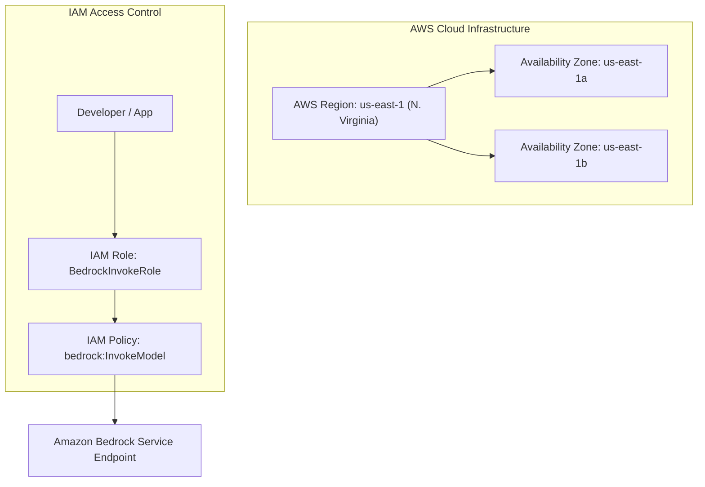

# 05. Prompts, Tokens & Inference Fundamentals

<VideoSection title="AI Basics for beginners: LLMs, prompts, agents, tokens & MCP: Prompts, Tokens & Inference Fundamentals" youtubeId="-C1gmYijZho" duration="07:15" motto="Official AWS Bedrock Video Tutorial tailored to Prompts, Tokens & Inference with clickable timestamped transcripts." whatItDoes="Integrates topic-matched AWS Bedrock video lessons with synchronized transcripts and instant-jump topic bookmarks." clickInstructions="Click the video play button to start watching, or click any timestamp in the interactive transcript to jump directly to that topic." transcript=[{"time": "00:00", "text": "Introduction to Prompts, Tokens & Inference in Amazon Bedrock.", "timestamp": 0}, {"time": "03:15", "text": "Deep-dive technical walkthrough of Prompts, Tokens & Inference.", "timestamp": 195}, {"time": "07:30", "text": "Production best practices and hands-on architecture for Prompts, Tokens & Inference.", "timestamp": 450}] bookmarks=[{"title": "Introduction", "time": "00:00", "timestamp": 0}, {"title": "Prompts, Tokens & Inference Deep-Dive", "time": "03:15", "timestamp": 195}, {"title": "Production Practices", "time": "07:30", "timestamp": 450}] kbId="doc_aws_bedrock_production" />

## WHAT ARE TOKENS?
Computers do not process English text directly. LLMs break text into numerical fragments called **Tokens**.

> Rule of Thumb: **1 Token ≈ 4 characters or 0.75 words** in English.
> 1,000 Tokens ≈ 750 words.

```
"Cloud Computing" ──► Split Tokens: ["Cloud", " Comput", "ing"] ──► Token Numbers: [14201, 8821, 312]
```

## WHAT IS INFERENCE?
**Inference** is the process of passing a prompt to a trained model and receiving a generated response.

```
User Input (Prompt Tokens) ──► Model Processing (Inference) ──► Output Generated (Response Tokens)
```

## REFERENCE EXAMPLE: TOKEN ESTIMATOR
- Text: `"Amazon Bedrock is a serverless generative AI service."`
- Estimated Words: 8 words
- Estimated Tokens: ~11 tokens

> [!IMPORTANT]
> Both input prompt tokens AND output generated tokens contribute to API latency and AWS billing costs!

```widget:CostCalculator
# Amazon Bedrock Token Cost Estimation Reference Matrix
MODEL_PRICING = {
    "claude-3-5-sonnet": {"input_per_1k": 0.003, "output_per_1k": 0.015},
    "claude-3-5-haiku": {"input_per_1k": 0.0008, "output_per_1k": 0.004},
    "amazon-nova-pro": {"input_per_1k": 0.0008, "output_per_1k": 0.0032},
    "amazon-nova-lite": {"input_per_1k": 0.00006, "output_per_1k": 0.00024}
}

def calculate_monthly_bedrock_cost(model_key, daily_requests, avg_input_tokens, avg_output_tokens):
    price = MODEL_PRICING[model_key]
    daily_cost = (daily_requests * (avg_input_tokens / 1000.0) * price["input_per_1k"]) + \
                 (daily_requests * (avg_output_tokens / 1000.0) * price["output_per_1k"])
    return round(daily_cost * 30, 2)
```

## VISUAL ARCHITECTURE DIAGRAM


