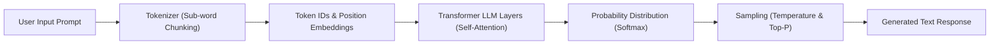

# 01. How Large Language Models Work Conceptually

<VideoSection title="Large Language Models explained briefly: How Large Language Models Work Conceptually" youtubeId="LPZh9BOjkQs" duration="06:30" motto="Official AWS Bedrock Video Tutorial tailored to LLM Conceptual Mechanics with clickable timestamped transcripts." whatItDoes="Integrates topic-matched AWS Bedrock video lessons with synchronized transcripts and instant-jump topic bookmarks." clickInstructions="Click the video play button to start watching, or click any timestamp in the interactive transcript to jump directly to that topic." transcript=[{"time": "00:00", "text": "Introduction to LLM Conceptual Mechanics in Amazon Bedrock.", "timestamp": 0}, {"time": "03:15", "text": "Deep-dive technical walkthrough of LLM Conceptual Mechanics.", "timestamp": 195}, {"time": "07:30", "text": "Production best practices and hands-on architecture for LLM Conceptual Mechanics.", "timestamp": 450}] bookmarks=[{"title": "Introduction", "time": "00:00", "timestamp": 0}, {"title": "LLM Conceptual Mechanics Deep-Dive", "time": "03:15", "timestamp": 195}, {"title": "Production Practices", "time": "07:30", "timestamp": 450}] kbId="doc_aws_bedrock_production" />

## WHAT DOES AN LLM ACTUALLY DO?
At its core, a Large Language Model is an **ultra-advanced next-token predictor**.

Given a sequence of words:
> `"The sun rises in the..."`

The model calculates probabilities across its vocabulary:
- `east`: 98.4%
- `morning`: 1.2%
- `west`: 0.1%

It selects `east` and appends it, then predicts the next token after `"The sun rises in the east..."`.

## REAL-LIFE ANALOGY
- **Autocomplete on your smartphone**: When you type "See you...", your keyboard suggests "tomorrow" or "later". An LLM is like smartphone autocomplete trained on billions of books, articles, code repos, and websites!

```
Input Sequence ──► Probability Calculation ──► Predict Next Token ──► Loop Output
```

> [!NOTE]
> LLMs do not "think" or possess conscious feelings—they compute statistical probabilities across high-dimensional mathematical representations!

## VISUAL ARCHITECTURE DIAGRAM


