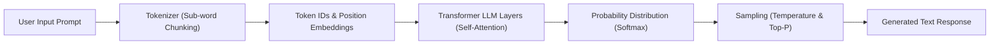

# 02. Pre-Training vs Fine-Tuning vs Inference

<VideoSection title="AI ML Training versus Inference: Pre-Training vs Fine-Tuning vs Inference" youtubeId="lsPucobtdDk" duration="03:53" motto="Official AWS Bedrock Video Tutorial tailored to Training vs Inference with clickable timestamped transcripts." whatItDoes="Integrates topic-matched AWS Bedrock video lessons with synchronized transcripts and instant-jump topic bookmarks." clickInstructions="Click the video play button to start watching, or click any timestamp in the interactive transcript to jump directly to that topic." transcript=[{"time": "00:00", "text": "Introduction to Training vs Inference in Amazon Bedrock.", "timestamp": 0}, {"time": "03:15", "text": "Deep-dive technical walkthrough of Training vs Inference.", "timestamp": 195}, {"time": "07:30", "text": "Production best practices and hands-on architecture for Training vs Inference.", "timestamp": 450}] bookmarks=[{"title": "Introduction", "time": "00:00", "timestamp": 0}, {"title": "Training vs Inference Deep-Dive", "time": "03:15", "timestamp": 195}, {"title": "Production Practices", "time": "07:30", "timestamp": 450}] kbId="doc_aws_bedrock_production" />

## WHAT ARE THE 3 STAGES OF MODEL LIFECYCLE?

| Stage | What Happens | Analogy | Cost / Time |
| :--- | :--- | :--- | :--- |
| **Pre-Training** | Model reads trillions of web pages to learn grammar, facts, and reasoning patterns. | Medical student spending 6 years in medical school studying textbooks. | Millions of dollars, thousands of GPUs, months of training. (Done by Anthropic/Meta/Amazon) |
| **Fine-Tuning / Customization** | Adapting pre-trained model on specialized internal dataset (e.g. medical records). | General doctor doing specialized residency training in Cardiology. | Moderate cost, custom S3 dataset. |
| **Inference (API Invocation)** | Sending a prompt and getting an answer. | Patient asking the doctor a health question during an appointment. | Fractional cents per request via Amazon Bedrock! |

```
Pre-Training (Massive Data) ──► Base Model ──► Fine-Tuning (Specialized Data) ──► Inference (User Prompt)
```

> [!TIP]
> 99% of cloud applications only need **Inference** via Amazon Bedrock! You rarely need to train or fine-tune models from scratch.

## VISUAL ARCHITECTURE DIAGRAM


