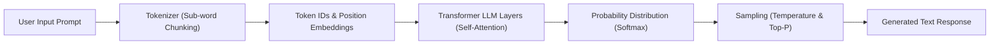

# 03. Context Window & Memory Limits

<VideoSection title="Tokens, Sub-words & Context Window Limits: Context Window & Memory Limits" youtubeId="-QVoIxEpFkM" duration="14:11" motto="Official AWS Bedrock Video Tutorial tailored to Tokens & Context Windows with clickable timestamped transcripts." whatItDoes="Integrates topic-matched AWS Bedrock video lessons with synchronized transcripts and instant-jump topic bookmarks." clickInstructions="Click the video play button to start watching, or click any timestamp in the interactive transcript to jump directly to that topic." transcript=[{"time": "00:00", "text": "Introduction to Tokens & Context Windows in Amazon Bedrock.", "timestamp": 0}, {"time": "03:15", "text": "Deep-dive technical walkthrough of Tokens & Context Windows.", "timestamp": 195}, {"time": "07:30", "text": "Production best practices and hands-on architecture for Tokens & Context Windows.", "timestamp": 450}] bookmarks=[{"title": "Introduction", "time": "00:00", "timestamp": 0}, {"title": "Tokens & Context Windows Deep-Dive", "time": "03:15", "timestamp": 195}, {"title": "Production Practices", "time": "07:30", "timestamp": 450}] kbId="doc_aws_bedrock_production" />

## WHAT IS A CONTEXT WINDOW?
The **Context Window** is the maximum number of tokens a model can read and process in a single conversation turn (including system instructions, conversation history, user prompt, and generated output).

## REAL-LIFE ANALOGY
- **Context Window = Desk Surface Area**:
  - Small desk (4K tokens): Can hold 3 sheets of paper.
  - Large desk (200K tokens): Can hold an entire 500-page book at once!

```
Claude 3.5 Sonnet Context Window: 200,000 Tokens (~150,000 words or 500 pages)
Amazon Nova Pro Context Window: 300,000 Tokens (~225,000 words)
```

## WHY CONTEXT WINDOW MATTERS FOR RAG & CHATBOTS
If your conversation exceeds the model's context window:
1. Older messages are truncated or dropped.
2. The model forgets earlier user instructions.

> [!IMPORTANT]
> A larger context window allows you to feed long PDFs, full codebases, or multi-turn chat transcripts directly into Amazon Bedrock!

## VISUAL ARCHITECTURE DIAGRAM


