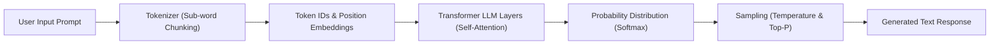

# 04. Temperature, Top-P & Inference Parameters

<VideoSection title="Tuning Temperature, Top-P, and Generation Parameters: Temperature, Top-P & Inference Parameters" youtubeId="b0hQ9ikTeyo" duration="09:15" motto="Official AWS Bedrock Video Tutorial tailored to Temperature & Top-P Parameters with clickable timestamped transcripts." whatItDoes="Integrates topic-matched AWS Bedrock video lessons with synchronized transcripts and instant-jump topic bookmarks." clickInstructions="Click the video play button to start watching, or click any timestamp in the interactive transcript to jump directly to that topic." transcript=[{"time": "00:00", "text": "Introduction to Temperature & Top-P Parameters in Amazon Bedrock.", "timestamp": 0}, {"time": "03:15", "text": "Deep-dive technical walkthrough of Temperature & Top-P Parameters.", "timestamp": 195}, {"time": "07:30", "text": "Production best practices and hands-on architecture for Temperature & Top-P Parameters.", "timestamp": 450}] bookmarks=[{"title": "Introduction", "time": "00:00", "timestamp": 0}, {"title": "Temperature & Top-P Parameters Deep-Dive", "time": "03:15", "timestamp": 195}, {"title": "Production Practices", "time": "07:30", "timestamp": 450}] kbId="doc_aws_bedrock_production" />

## WHAT ARE INFERENCE PARAMETERS?
Inference parameters are controls you pass to Amazon Bedrock to shape HOW the model chooses its next tokens.

## KEY PARAMETERS EXPLAINED

### 1. Temperature (`0.0` to `1.0`)
Controls output randomness:
- `0.0`: **Deterministic & Precise**. Always picks the highest-probability token. Ideal for SQL generation, medical code, financial calculations.
- `0.5`: **Balanced**. Standard default for conversational chatbots and general writing.
- `1.0`: **Creative & Random**. Explores lower-probability tokens. Ideal for poetry, fiction, brainstorming.

### 2. Top-P (Nucleus Sampling)
Considers tokens whose cumulative probability exceeds `Top-P` (e.g. `0.9` considers top 90% candidate pool).

## REFERENCE EXAMPLE: PLAYGROUND PARAMETERS
Experiment with temperature and inference parameters in the interactive playground below:

```widget:BedrockPlayground
{
  "modelId": "anthropic.claude-3-5-sonnet-20241022-v2:0",
  "inferenceConfig": {
    "temperature": 0.7,
    "topP": 0.9,
    "maxTokens": 2048,
    "stopSequences": ["\n\nHuman:"]
  },
  "systemPrompt": "You are a senior AWS Solutions Architect specializing in serverless Bedrock architectures.",
  "userPrompt": "Explain how Amazon Bedrock Knowledge Bases sync with OpenSearch Serverless vector indices."
}
```

## VISUAL ARCHITECTURE DIAGRAM


