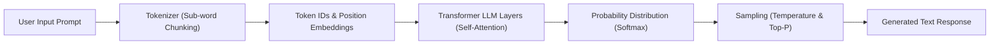

# 05. Hallucinations & Multimodal AI

<VideoSection title="Hallucination Mitigation & Multimodal AI Vision Models: Hallucinations & Multimodal AI" youtubeId="3WPSTvYRM2Y" duration="16:18" motto="Official AWS Bedrock Video Tutorial tailored to Hallucinations & Multimodal AI with clickable timestamped transcripts." whatItDoes="Integrates topic-matched AWS Bedrock video lessons with synchronized transcripts and instant-jump topic bookmarks." clickInstructions="Click the video play button to start watching, or click any timestamp in the interactive transcript to jump directly to that topic." transcript=[{"time": "00:00", "text": "Introduction to Hallucinations & Multimodal AI in Amazon Bedrock.", "timestamp": 0}, {"time": "03:15", "text": "Deep-dive technical walkthrough of Hallucinations & Multimodal AI.", "timestamp": 195}, {"time": "07:30", "text": "Production best practices and hands-on architecture for Hallucinations & Multimodal AI.", "timestamp": 450}] bookmarks=[{"title": "Introduction", "time": "00:00", "timestamp": 0}, {"title": "Hallucinations & Multimodal AI Deep-Dive", "time": "03:15", "timestamp": 195}, {"title": "Production Practices", "time": "07:30", "timestamp": 450}] kbId="doc_aws_bedrock_production" />

## WHAT IS A HALLUCINATION?
A **Hallucination** occurs when a model generates plausible-sounding statements that are factually false, ungrounded, or fabricated.

## WHY DO HALLUCINATIONS HAPPEN?
Because LLMs predict probable tokens based on statistical patterns rather than consulting a real-time factual database.

```
User: "What was company revenue in Q4 2025?"
Model (No External Data): Fabricates plausible-sounding numbers.
```

## HOW TO PREVENT HALLUCINATIONS
1. **RAG (Retrieval-Augmented Generation)**: Supply real enterprise documents directly inside the prompt context.
2. **Bedrock Guardrails**: Enforce contextual grounding checks.
3. **Lower Temperature**: Set temperature to `0.0`.

## WHAT IS MULTIMODAL AI?
Multimodal AI models can process and understand multiple types of media inputs (e.g. text + images + charts + videos) simultaneously.

> Example: Passing an architecture diagram image + text prompt into Claude 3.5 Sonnet to automatically generate Terraform code!

## VISUAL ARCHITECTURE DIAGRAM


