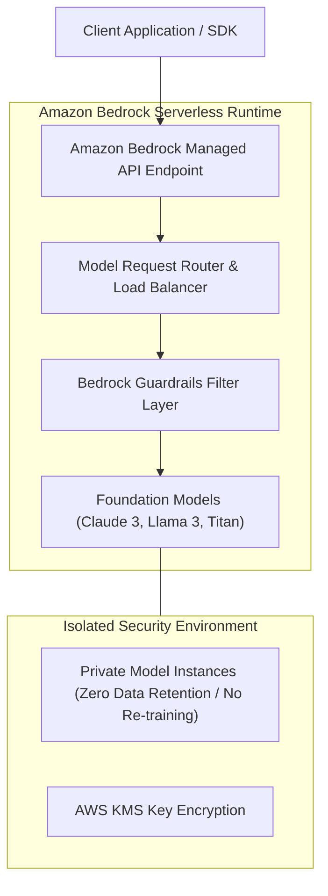

# 01. What is Amazon Bedrock?

<VideoSection title="Amazon Bedrock Overview: Serverless Managed Foundation Models: What is Amazon Bedrock?" youtubeId="mhItmKsB5tQ" duration="08:35" motto="Official AWS Bedrock Video Tutorial tailored to Amazon Bedrock Overview with clickable timestamped transcripts." whatItDoes="Integrates topic-matched AWS Bedrock video lessons with synchronized transcripts and instant-jump topic bookmarks." clickInstructions="Click the video play button to start watching, or click any timestamp in the interactive transcript to jump directly to that topic." transcript=[{"time": "00:00", "text": "Introduction to Amazon Bedrock Overview in Amazon Bedrock.", "timestamp": 0}, {"time": "03:15", "text": "Deep-dive technical walkthrough of Amazon Bedrock Overview.", "timestamp": 195}, {"time": "07:30", "text": "Production best practices and hands-on architecture for Amazon Bedrock Overview.", "timestamp": 450}] bookmarks=[{"title": "Introduction", "time": "00:00", "timestamp": 0}, {"title": "Amazon Bedrock Overview Deep-Dive", "time": "03:15", "timestamp": 195}, {"title": "Production Practices", "time": "07:30", "timestamp": 450}] kbId="doc_aws_bedrock_production" />

## WHAT IS AMAZON BEDROCK?
Amazon Bedrock is a **fully managed serverless AWS service** that provides unified API access to leading foundation models from Anthropic, Meta, Amazon, Mistral, Cohere, and AI21 Labs.

## WHY AMAZON BEDROCK?
- **Serverless**: Zero server or GPU management.
- **Unified API**: One single SDK (`converse` API) works across all model providers.
- **Data Privacy**: Your prompts, data, and embeddings are NEVER used to train underlying base models, and never leave your AWS VPC boundary.
- **Enterprise Security**: Integrates natively with AWS IAM, CloudWatch logging, KMS encryption, and Guardrails.

```
Client App / SDK ──► AWS IAM Authentication ──► Amazon Bedrock API ──► Target Model (Claude / Llama / Nova)
```

> [!IMPORTANT]
> Bedrock keeps your enterprise data 100% confidential and isolated inside your AWS account!

## VISUAL ARCHITECTURE DIAGRAM


