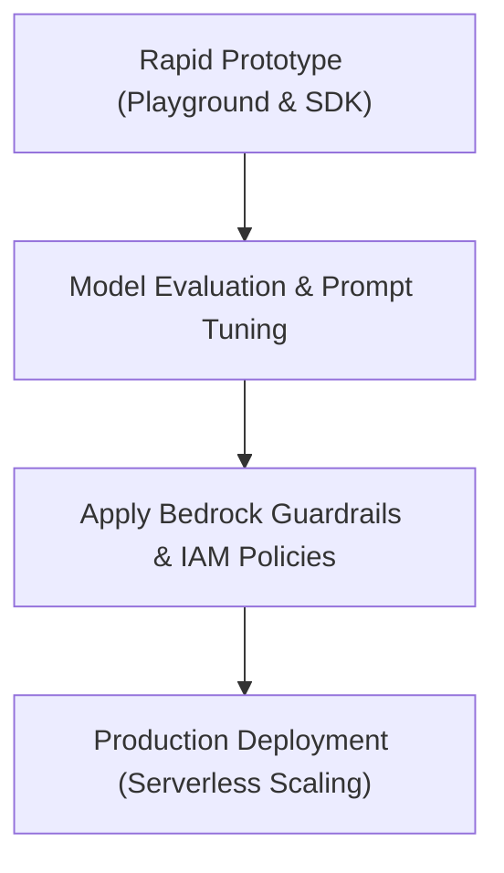

# 02. Fast-Track Gen AI from Prototype to Production with Amazon Bedrock

<VideoSection title="Amazon Bedrock: Fast-track gen AI from prototype to production" youtubeId="nSQrY-uPWLY" duration="02:06" motto="Official AWS Bedrock Video Tutorial tailored to Amazon Bedrock: Fast-track gen AI from prototype to production with clickable timestamped transcripts." whatItDoes="Integrates topic-matched AWS Bedrock video lessons with synchronized transcripts and instant-jump topic bookmarks." clickInstructions="Click the video play button to start watching, or click any timestamp in the interactive transcript to jump directly to that topic." transcript=[{"time": "00:00", "text": "Introduction to Amazon Bedrock: Fast-track gen AI from prototype to production in Amazon Bedrock.", "timestamp": 0}, {"time": "01:15", "text": "Technical deep-dive and operational breakdown of Amazon Bedrock: Fast-track gen AI from prototype to production.", "timestamp": 75}, {"time": "02:30", "text": "Production implementation and enterprise best practices for Amazon Bedrock: Fast-track gen AI from prototype to production.", "timestamp": 150}] bookmarks=[{"title": "Introduction & Key Concepts", "time": "00:00", "timestamp": 0}, {"title": "Technical Walkthrough", "time": "01:15", "timestamp": 75}, {"title": "Production Best Practices", "time": "02:30", "timestamp": 150}] kbId="doc_aws_bedrock_production" />

## TOPIC OVERVIEW
Learn how Amazon Bedrock accelerates your Generative AI development lifecycle from fast rapid prototyping to scalable enterprise production deployment.

## KEY ARCHITECTURAL & OPERATIONAL CONCEPTS
- **Serverless Architecture**:  Provision foundation models instantly without managing GPU clusters.
- **Unified API Interface**:  Leverage the Boto3 Converse API to switch models seamlessly.
- **Production Readiness**:  Built-in IAM security, KMS encryption, and auto-scaling throughput.

> [!NOTE]
> All model integrations and workflows in Amazon Bedrock strictly observe AWS security boundaries, KMS key encryption, and zero data retention policies!

## VISUAL WORKFLOW & ARCHITECTURE DIAGRAM

## ENTERPRISE BEST PRACTICES
1. **Decoupled Architecture**: Use the standard Boto3 Converse API to avoid binding client code to a specific model provider.
2. **Safety First**: Attach Bedrock Guardrails to all model invocation requests to prevent PII leaks and prompt injection attacks.
3. **Observability**: Enable CloudWatch model invocation logging for compliance tracking and cost monitoring.
