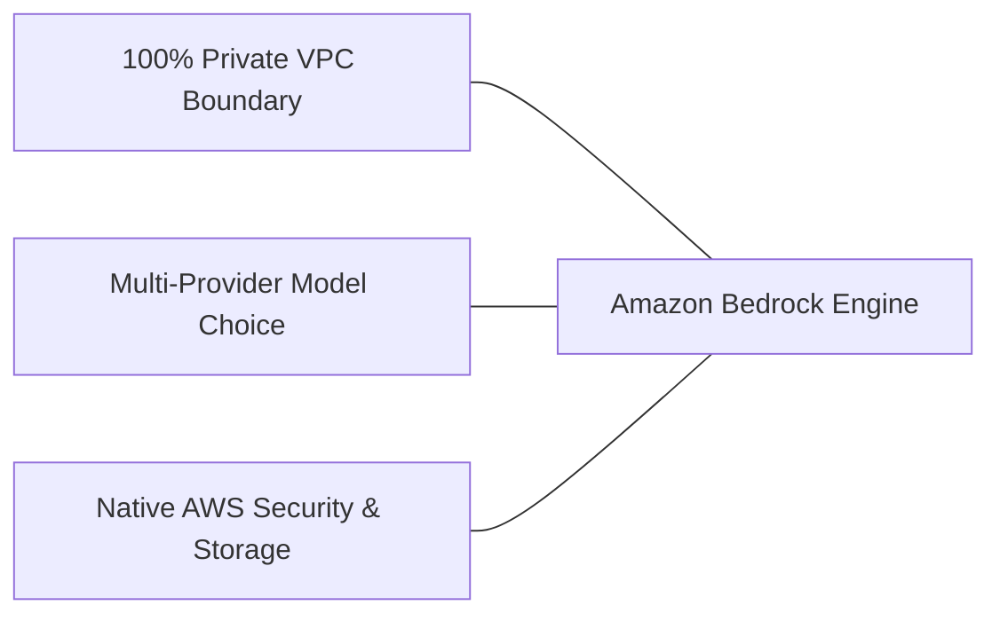

# 03. Top Reasons to Build & Scale Generative AI Applications on AWS

<VideoSection title="Top reasons to build & scale generative AI applications on AWS" youtubeId="_Jjmdi__bes" duration="02:19" motto="Official AWS Bedrock Video Tutorial tailored to Top reasons to build & scale generative AI applications on AWS with clickable timestamped transcripts." whatItDoes="Integrates topic-matched AWS Bedrock video lessons with synchronized transcripts and instant-jump topic bookmarks." clickInstructions="Click the video play button to start watching, or click any timestamp in the interactive transcript to jump directly to that topic." transcript=[{"time": "00:00", "text": "Introduction to Top reasons to build & scale generative AI applications on AWS in Amazon Bedrock.", "timestamp": 0}, {"time": "01:15", "text": "Technical deep-dive and operational breakdown of Top reasons to build & scale generative AI applications on AWS.", "timestamp": 75}, {"time": "02:30", "text": "Production implementation and enterprise best practices for Top reasons to build & scale generative AI applications on AWS.", "timestamp": 150}] bookmarks=[{"title": "Introduction & Key Concepts", "time": "00:00", "timestamp": 0}, {"title": "Technical Walkthrough", "time": "01:15", "timestamp": 75}, {"title": "Production Best Practices", "time": "02:30", "timestamp": 150}] kbId="doc_aws_bedrock_production" />

## TOPIC OVERVIEW
Discover why world-class enterprises choose AWS Bedrock for building, customizing, and scaling enterprise AI applications.

## KEY ARCHITECTURAL & OPERATIONAL CONCEPTS
- **Data Privacy & Isolation**:  Data remains in your AWS account and is never used to train base models.
- **Broadest Choice of Foundation Models**:  Access Claude, Llama, Nova, Titan, Mistral, and Cohere under one roof.
- **Native AWS Integration**:  Direct connectivity with S3, Lambda, CloudWatch, and OpenSearch Service.

> [!NOTE]
> All model integrations and workflows in Amazon Bedrock strictly observe AWS security boundaries, KMS key encryption, and zero data retention policies!

## VISUAL WORKFLOW & ARCHITECTURE DIAGRAM

## ENTERPRISE BEST PRACTICES
1. **Decoupled Architecture**: Use the standard Boto3 Converse API to avoid binding client code to a specific model provider.
2. **Safety First**: Attach Bedrock Guardrails to all model invocation requests to prevent PII leaks and prompt injection attacks.
3. **Observability**: Enable CloudWatch model invocation logging for compliance tracking and cost monitoring.
