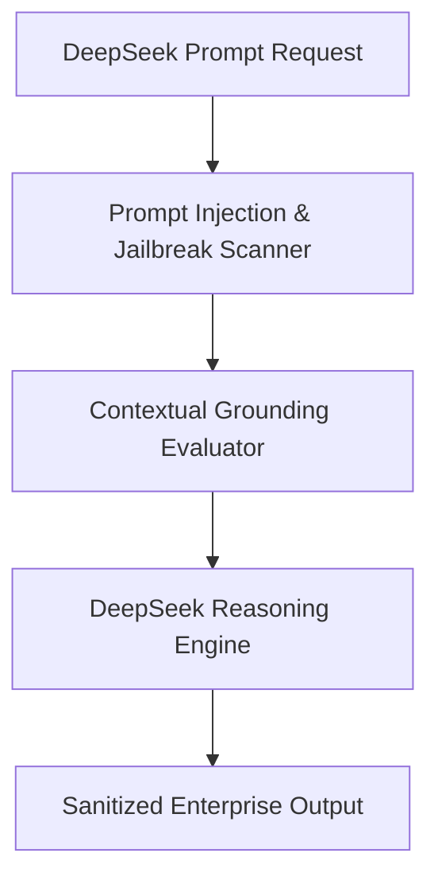

# 05. Protect Your DeepSeek Model Deployments with Amazon Bedrock Guardrails

<VideoSection title="Protect your DeepSeek model deployments with Amazon Bedrock Guardrails" youtubeId="DV42vlp-RMg" duration="09:16" motto="Official AWS Bedrock Video Tutorial tailored to Protect your DeepSeek model deployments with Amazon Bedrock Guardrails with clickable timestamped transcripts." whatItDoes="Integrates topic-matched AWS Bedrock video lessons with synchronized transcripts and instant-jump topic bookmarks." clickInstructions="Click the video play button to start watching, or click any timestamp in the interactive transcript to jump directly to that topic." transcript=[{"time": "00:00", "text": "Introduction to Protect your DeepSeek model deployments with Amazon Bedrock Guardrails in Amazon Bedrock.", "timestamp": 0}, {"time": "01:15", "text": "Technical deep-dive and operational breakdown of Protect your DeepSeek model deployments with Amazon Bedrock Guardrails.", "timestamp": 75}, {"time": "02:30", "text": "Production implementation and enterprise best practices for Protect your DeepSeek model deployments with Amazon Bedrock Guardrails.", "timestamp": 150}] bookmarks=[{"title": "Introduction & Key Concepts", "time": "00:00", "timestamp": 0}, {"title": "Technical Walkthrough", "time": "01:15", "timestamp": 75}, {"title": "Production Best Practices", "time": "02:30", "timestamp": 150}] kbId="doc_aws_bedrock_production" />

## TOPIC OVERVIEW
Deep-dive into protecting custom DeepSeek model deployments on Bedrock using continuous safety evaluation and prompt injection filters.

## KEY ARCHITECTURAL & OPERATIONAL CONCEPTS
- **Prompt Injection Safeguards**:  Prevent malicious user overrides and system prompt extractions.
- **Contextual Grounding Checks**:  Verify model outputs against retrieved RAG facts to prevent hallucinations.
- **Custom Regex & Word Filters**:  Block corporate proprietary terms and inappropriate slang.

> [!NOTE]
> All model integrations and workflows in Amazon Bedrock strictly observe AWS security boundaries, KMS key encryption, and zero data retention policies!

## VISUAL WORKFLOW & ARCHITECTURE DIAGRAM

## ENTERPRISE BEST PRACTICES
1. **Decoupled Architecture**: Use the standard Boto3 Converse API to avoid binding client code to a specific model provider.
2. **Safety First**: Attach Bedrock Guardrails to all model invocation requests to prevent PII leaks and prompt injection attacks.
3. **Observability**: Enable CloudWatch model invocation logging for compliance tracking and cost monitoring.
