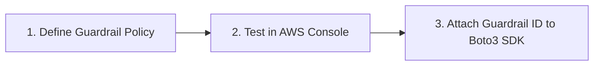

# 06. Hands-On Demo: Amazon Bedrock Guardrails in Action

<VideoSection title="NEW DEMO - Amazon Bedrock Guardrails | Amazon Web Services" youtubeId="srQxO_o9KgM" duration="09:34" motto="Official AWS Bedrock Video Tutorial tailored to NEW DEMO - Amazon Bedrock Guardrails | Amazon Web Services with clickable timestamped transcripts." whatItDoes="Integrates topic-matched AWS Bedrock video lessons with synchronized transcripts and instant-jump topic bookmarks." clickInstructions="Click the video play button to start watching, or click any timestamp in the interactive transcript to jump directly to that topic." transcript=[{"time": "00:00", "text": "Introduction to NEW DEMO - Amazon Bedrock Guardrails | Amazon Web Services in Amazon Bedrock.", "timestamp": 0}, {"time": "01:15", "text": "Technical deep-dive and operational breakdown of NEW DEMO - Amazon Bedrock Guardrails | Amazon Web Services.", "timestamp": 75}, {"time": "02:30", "text": "Production implementation and enterprise best practices for NEW DEMO - Amazon Bedrock Guardrails | Amazon Web Services.", "timestamp": 150}] bookmarks=[{"title": "Introduction & Key Concepts", "time": "00:00", "timestamp": 0}, {"title": "Technical Walkthrough", "time": "01:15", "timestamp": 75}, {"title": "Production Best Practices", "time": "02:30", "timestamp": 150}] kbId="doc_aws_bedrock_production" />

## TOPIC OVERVIEW
Step-by-step walkthrough of creating, configuring, testing, and applying Amazon Bedrock Guardrails in the AWS Management Console.

## KEY ARCHITECTURAL & OPERATIONAL CONCEPTS
- **Console Configuration**:  Configuring thresholds for Hate, Violence, Sexual, and Insult categories.
- **Testing Playground**:  Simulating malicious queries in real-time before production deployment.
- **API Integration**:  Passing guardrailIdentifier and guardrailVersion in Boto3 Converse calls.

> [!NOTE]
> All model integrations and workflows in Amazon Bedrock strictly observe AWS security boundaries, KMS key encryption, and zero data retention policies!

## VISUAL WORKFLOW & ARCHITECTURE DIAGRAM

## ENTERPRISE BEST PRACTICES
1. **Decoupled Architecture**: Use the standard Boto3 Converse API to avoid binding client code to a specific model provider.
2. **Safety First**: Attach Bedrock Guardrails to all model invocation requests to prevent PII leaks and prompt injection attacks.
3. **Observability**: Enable CloudWatch model invocation logging for compliance tracking and cost monitoring.
