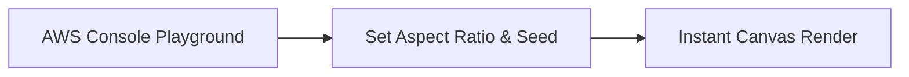

# 12. Amazon Titan Image Generator: Image Playground Demo

<VideoSection title="Amazon Titan Image Generator Demo - Image Playground" youtubeId="88pHCBRKfEI" duration="05:54" motto="Official AWS Bedrock Video Tutorial tailored to Amazon Titan Image Generator Demo - Image Playground with clickable timestamped transcripts." whatItDoes="Integrates topic-matched AWS Bedrock video lessons with synchronized transcripts and instant-jump topic bookmarks." clickInstructions="Click the video play button to start watching, or click any timestamp in the interactive transcript to jump directly to that topic." transcript=[{"time": "00:00", "text": "Introduction to Amazon Titan Image Generator Demo - Image Playground in Amazon Bedrock.", "timestamp": 0}, {"time": "01:15", "text": "Technical deep-dive and operational breakdown of Amazon Titan Image Generator Demo - Image Playground.", "timestamp": 75}, {"time": "02:30", "text": "Production implementation and enterprise best practices for Amazon Titan Image Generator Demo - Image Playground.", "timestamp": 150}] bookmarks=[{"title": "Introduction & Key Concepts", "time": "00:00", "timestamp": 0}, {"title": "Technical Walkthrough", "time": "01:15", "timestamp": 75}, {"title": "Production Best Practices", "time": "02:30", "timestamp": 150}] kbId="doc_aws_bedrock_production" />

## TOPIC OVERVIEW
Interactive visual walkthrough of using the Amazon Bedrock Image Playground to tweak generation parameters, aspect ratios, and seed numbers.

## KEY ARCHITECTURAL & OPERATIONAL CONCEPTS
- **Parameter Tuning**:  Adjusting seed, quality settings, cfg_scale, and resolution in real-time.
- **Interactive Masking**:  Using console drawing tools to define inpainting edit regions.
- **Prompt Optimization**:  Crafting detailed prompts for optimal lighting, style, and camera angles.

> [!NOTE]
> All model integrations and workflows in Amazon Bedrock strictly observe AWS security boundaries, KMS key encryption, and zero data retention policies!

## VISUAL WORKFLOW & ARCHITECTURE DIAGRAM

## ENTERPRISE BEST PRACTICES
1. **Decoupled Architecture**: Use the standard Boto3 Converse API to avoid binding client code to a specific model provider.
2. **Safety First**: Attach Bedrock Guardrails to all model invocation requests to prevent PII leaks and prompt injection attacks.
3. **Observability**: Enable CloudWatch model invocation logging for compliance tracking and cost monitoring.
