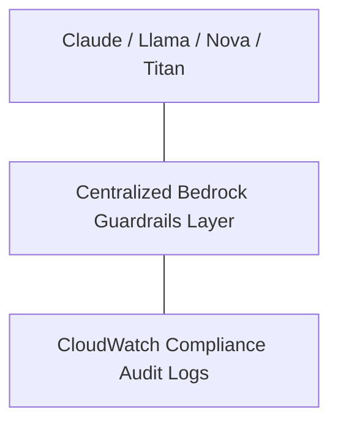

# 14. Safeguarding Enterprise Generative AI with Bedrock Guardrails

<VideoSection title="Amazon Bedrock Guardrails to safeguard generative AI" youtubeId="Vhwc_ahFv6E" duration="01:10" motto="Official AWS Bedrock Video Tutorial tailored to Amazon Bedrock Guardrails to safeguard generative AI with clickable timestamped transcripts." whatItDoes="Integrates topic-matched AWS Bedrock video lessons with synchronized transcripts and instant-jump topic bookmarks." clickInstructions="Click the video play button to start watching, or click any timestamp in the interactive transcript to jump directly to that topic." transcript=[{"time": "00:00", "text": "Introduction to Amazon Bedrock Guardrails to safeguard generative AI in Amazon Bedrock.", "timestamp": 0}, {"time": "01:15", "text": "Technical deep-dive and operational breakdown of Amazon Bedrock Guardrails to safeguard generative AI.", "timestamp": 75}, {"time": "02:30", "text": "Production implementation and enterprise best practices for Amazon Bedrock Guardrails to safeguard generative AI.", "timestamp": 150}] bookmarks=[{"title": "Introduction & Key Concepts", "time": "00:00", "timestamp": 0}, {"title": "Technical Walkthrough", "time": "01:15", "timestamp": 75}, {"title": "Production Best Practices", "time": "02:30", "timestamp": 150}] kbId="doc_aws_bedrock_production" />

## TOPIC OVERVIEW
Executive overview of Bedrock Guardrails as a single centralized governance plane across all foundation models.

## KEY ARCHITECTURAL & OPERATIONAL CONCEPTS
- **Consistent Safety Across Models**:  Apply identical safety policies across Claude, Llama, Nova, and Titan.
- **Regulatory Compliance**:  Align AI operations with HIPAA, GDPR, and enterprise data security frameworks.
- **Real-time Monitoring**:  Audit blocked events and safety metrics in CloudWatch Logs.

> [!NOTE]
> All model integrations and workflows in Amazon Bedrock strictly observe AWS security boundaries, KMS key encryption, and zero data retention policies!

## VISUAL WORKFLOW & ARCHITECTURE DIAGRAM

## ENTERPRISE BEST PRACTICES
1. **Decoupled Architecture**: Use the standard Boto3 Converse API to avoid binding client code to a specific model provider.
2. **Safety First**: Attach Bedrock Guardrails to all model invocation requests to prevent PII leaks and prompt injection attacks.
3. **Observability**: Enable CloudWatch model invocation logging for compliance tracking and cost monitoring.
