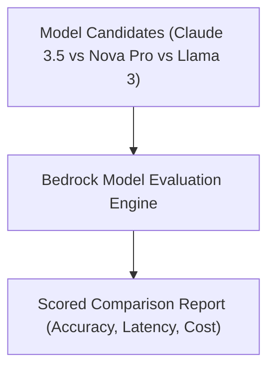

# 15. Model Evaluation in Amazon Bedrock: Comparing & Selecting Models

<VideoSection title="Model Evaluation in Amazon Bedrock to compare & choose models" youtubeId="vyppgNFzhvM" duration="01:33" motto="Official AWS Bedrock Video Tutorial tailored to Model Evaluation in Amazon Bedrock to compare & choose models with clickable timestamped transcripts." whatItDoes="Integrates topic-matched AWS Bedrock video lessons with synchronized transcripts and instant-jump topic bookmarks." clickInstructions="Click the video play button to start watching, or click any timestamp in the interactive transcript to jump directly to that topic." transcript=[{"time": "00:00", "text": "Introduction to Model Evaluation in Amazon Bedrock to compare & choose models in Amazon Bedrock.", "timestamp": 0}, {"time": "01:15", "text": "Technical deep-dive and operational breakdown of Model Evaluation in Amazon Bedrock to compare & choose models.", "timestamp": 75}, {"time": "02:30", "text": "Production implementation and enterprise best practices for Model Evaluation in Amazon Bedrock to compare & choose models.", "timestamp": 150}] bookmarks=[{"title": "Introduction & Key Concepts", "time": "00:00", "timestamp": 0}, {"title": "Technical Walkthrough", "time": "01:15", "timestamp": 75}, {"title": "Production Best Practices", "time": "02:30", "timestamp": 150}] kbId="doc_aws_bedrock_production" />

## TOPIC OVERVIEW
Overview of Bedrock Model Evaluation tools for measuring accuracy, robustness, toxicity, and latency across foundation models.

## KEY ARCHITECTURAL & OPERATIONAL CONCEPTS
- **Automatic Evaluation**:  Use pre-built benchmark datasets (e.g. MMLU, GSM8K) for instant scoring.
- **Human-in-the-Loop Evaluation**:  Integrate internal team reviewers or AWS managed human evaluators.
- **Metric Breakdown**:  Benchmark models on factual accuracy, relevance, robustness, and safety.

> [!NOTE]
> All model integrations and workflows in Amazon Bedrock strictly observe AWS security boundaries, KMS key encryption, and zero data retention policies!

## VISUAL WORKFLOW & ARCHITECTURE DIAGRAM

## ENTERPRISE BEST PRACTICES
1. **Decoupled Architecture**: Use the standard Boto3 Converse API to avoid binding client code to a specific model provider.
2. **Safety First**: Attach Bedrock Guardrails to all model invocation requests to prevent PII leaks and prompt injection attacks.
3. **Observability**: Enable CloudWatch model invocation logging for compliance tracking and cost monitoring.
