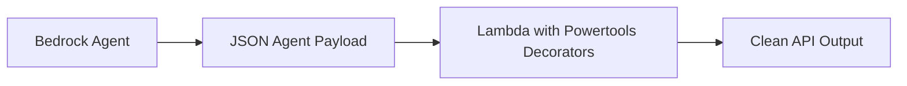

# 21. Authoring Amazon Bedrock Agents with Powertools for AWS Lambda

<VideoSection title="Authoring Amazon Bedrock Agents with Powertools for AWS" youtubeId="NWoC5FTSt7s" duration="17:20" motto="Official AWS Bedrock Video Tutorial tailored to Authoring Amazon Bedrock Agents with Powertools for AWS with clickable timestamped transcripts." whatItDoes="Integrates topic-matched AWS Bedrock video lessons with synchronized transcripts and instant-jump topic bookmarks." clickInstructions="Click the video play button to start watching, or click any timestamp in the interactive transcript to jump directly to that topic." transcript=[{"time": "00:00", "text": "Introduction to Authoring Amazon Bedrock Agents with Powertools for AWS in Amazon Bedrock.", "timestamp": 0}, {"time": "01:15", "text": "Technical deep-dive and operational breakdown of Authoring Amazon Bedrock Agents with Powertools for AWS.", "timestamp": 75}, {"time": "02:30", "text": "Production implementation and enterprise best practices for Authoring Amazon Bedrock Agents with Powertools for AWS.", "timestamp": 150}] bookmarks=[{"title": "Introduction & Key Concepts", "time": "00:00", "timestamp": 0}, {"title": "Technical Walkthrough", "time": "01:15", "timestamp": 75}, {"title": "Production Best Practices", "time": "02:30", "timestamp": 150}] kbId="doc_aws_bedrock_production" />

## TOPIC OVERVIEW
Developer-focused guide to writing clean, maintainable Python AWS Lambda action groups for Bedrock Agents using Powertools for AWS.

## KEY ARCHITECTURAL & OPERATIONAL CONCEPTS
- **Powertools Event Handler**:  Parsing Bedrock Agent input payloads cleanly with Python decorators.
- **Structured Logging & Tracing**:  Exporting trace IDs from Bedrock Agent execution to AWS X-Ray.
- **Validation & Error Handling**:  Returning standardized responses back to Bedrock Agent reasoning engine.

> [!NOTE]
> All model integrations and workflows in Amazon Bedrock strictly observe AWS security boundaries, KMS key encryption, and zero data retention policies!

## VISUAL WORKFLOW & ARCHITECTURE DIAGRAM

## ENTERPRISE BEST PRACTICES
1. **Decoupled Architecture**: Use the standard Boto3 Converse API to avoid binding client code to a specific model provider.
2. **Safety First**: Attach Bedrock Guardrails to all model invocation requests to prevent PII leaks and prompt injection attacks.
3. **Observability**: Enable CloudWatch model invocation logging for compliance tracking and cost monitoring.
