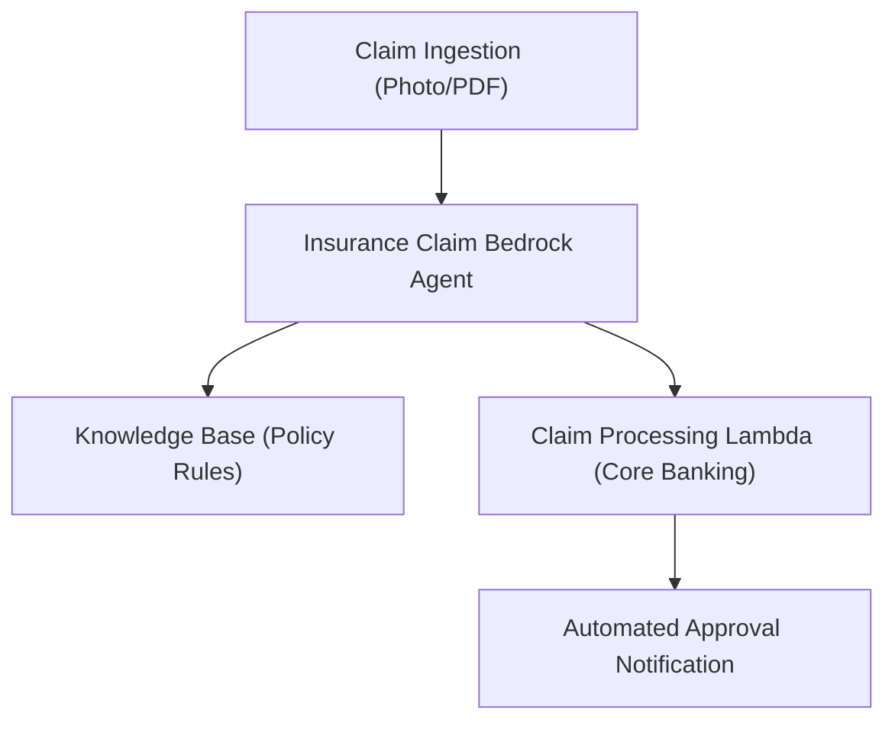

# 22. Automating the Insurance Claim Lifecycle with Agents & Knowledge Bases

<VideoSection title="Automate the insurance claim lifecycle using Agents and Knowledge Base" youtubeId="RFygzPr7qfw" duration="30:28" motto="Official AWS Bedrock Video Tutorial tailored to Automate the insurance claim lifecycle using Agents and Knowledge Base with clickable timestamped transcripts." whatItDoes="Integrates topic-matched AWS Bedrock video lessons with synchronized transcripts and instant-jump topic bookmarks." clickInstructions="Click the video play button to start watching, or click any timestamp in the interactive transcript to jump directly to that topic." transcript=[{"time": "00:00", "text": "Introduction to Automate the insurance claim lifecycle using Agents and Knowledge Base in Amazon Bedrock.", "timestamp": 0}, {"time": "01:15", "text": "Technical deep-dive and operational breakdown of Automate the insurance claim lifecycle using Agents and Knowledge Base.", "timestamp": 75}, {"time": "02:30", "text": "Production implementation and enterprise best practices for Automate the insurance claim lifecycle using Agents and Knowledge Base.", "timestamp": 150}] bookmarks=[{"title": "Introduction & Key Concepts", "time": "00:00", "timestamp": 0}, {"title": "Technical Walkthrough", "time": "01:15", "timestamp": 75}, {"title": "Production Best Practices", "time": "02:30", "timestamp": 150}] kbId="doc_aws_bedrock_production" />

## TOPIC OVERVIEW
Complete hands-on case study demonstrating end-to-end automation of insurance claim ingestion, validation, policy lookup, and approval using Bedrock Agents.

## KEY ARCHITECTURAL & OPERATIONAL CONCEPTS
- **Document Processing**:  Extracting claim details from submitted photos and PDFs.
- **Policy Retrieval**:  Querying Knowledge Base for deductible and coverage rules.
- **Automated Action Group**:  Invoking backend claim processing Lambda to issue approvals.

> [!NOTE]
> All model integrations and workflows in Amazon Bedrock strictly observe AWS security boundaries, KMS key encryption, and zero data retention policies!

## VISUAL WORKFLOW & ARCHITECTURE DIAGRAM

## ENTERPRISE BEST PRACTICES
1. **Decoupled Architecture**: Use the standard Boto3 Converse API to avoid binding client code to a specific model provider.
2. **Safety First**: Attach Bedrock Guardrails to all model invocation requests to prevent PII leaks and prompt injection attacks.
3. **Observability**: Enable CloudWatch model invocation logging for compliance tracking and cost monitoring.
