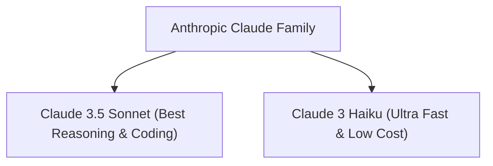

# 24. Anthropic's Claude Model Family on Amazon Bedrock Overview

<VideoSection title="Anthropic's Claude on Amazon Bedrock | Amazon Web Services" youtubeId="ZLEm-cLTXEo" duration="01:37" motto="Official AWS Bedrock Video Tutorial tailored to Anthropic's Claude on Amazon Bedrock | Amazon Web Services with clickable timestamped transcripts." whatItDoes="Integrates topic-matched AWS Bedrock video lessons with synchronized transcripts and instant-jump topic bookmarks." clickInstructions="Click the video play button to start watching, or click any timestamp in the interactive transcript to jump directly to that topic." transcript=[{"time": "00:00", "text": "Introduction to Anthropic's Claude on Amazon Bedrock | Amazon Web Services in Amazon Bedrock.", "timestamp": 0}, {"time": "01:15", "text": "Technical deep-dive and operational breakdown of Anthropic's Claude on Amazon Bedrock | Amazon Web Services.", "timestamp": 75}, {"time": "02:30", "text": "Production implementation and enterprise best practices for Anthropic's Claude on Amazon Bedrock | Amazon Web Services.", "timestamp": 150}] bookmarks=[{"title": "Introduction & Key Concepts", "time": "00:00", "timestamp": 0}, {"title": "Technical Walkthrough", "time": "01:15", "timestamp": 75}, {"title": "Production Best Practices", "time": "02:30", "timestamp": 150}] kbId="doc_aws_bedrock_production" />

## TOPIC OVERVIEW
Overview of Anthropic's Claude models available on Amazon Bedrock including Claude 3.5 Sonnet, Claude 3 Opus, and Claude 3 Haiku.

## KEY ARCHITECTURAL & OPERATIONAL CONCEPTS
- **Claude 3.5 Sonnet**:  Industry leader for coding, complex reasoning, and tool use.
- **Claude 3 Haiku**:  Lightning-fast, cost-optimized model for high-throughput micro-tasks.
- **200K Context Window**:  Processing entire codebases and books in a single prompt call.

> [!NOTE]
> All model integrations and workflows in Amazon Bedrock strictly observe AWS security boundaries, KMS key encryption, and zero data retention policies!

## VISUAL WORKFLOW & ARCHITECTURE DIAGRAM

## ENTERPRISE BEST PRACTICES
1. **Decoupled Architecture**: Use the standard Boto3 Converse API to avoid binding client code to a specific model provider.
2. **Safety First**: Attach Bedrock Guardrails to all model invocation requests to prevent PII leaks and prompt injection attacks.
3. **Observability**: Enable CloudWatch model invocation logging for compliance tracking and cost monitoring.
