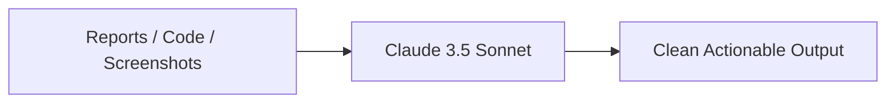

# 25. Anthropic Claude on Amazon Bedrock Enterprise Case Study

<VideoSection title="Anthropic Claude on Amazon Bedrock | Amazon Web Services" youtubeId="jk1Wylz3Pvc" duration="01:54" motto="Official AWS Bedrock Video Tutorial tailored to Anthropic Claude on Amazon Bedrock | Amazon Web Services with clickable timestamped transcripts." whatItDoes="Integrates topic-matched AWS Bedrock video lessons with synchronized transcripts and instant-jump topic bookmarks." clickInstructions="Click the video play button to start watching, or click any timestamp in the interactive transcript to jump directly to that topic." transcript=[{"time": "00:00", "text": "Introduction to Anthropic Claude on Amazon Bedrock | Amazon Web Services in Amazon Bedrock.", "timestamp": 0}, {"time": "01:15", "text": "Technical deep-dive and operational breakdown of Anthropic Claude on Amazon Bedrock | Amazon Web Services.", "timestamp": 75}, {"time": "02:30", "text": "Production implementation and enterprise best practices for Anthropic Claude on Amazon Bedrock | Amazon Web Services.", "timestamp": 150}] bookmarks=[{"title": "Introduction & Key Concepts", "time": "00:00", "timestamp": 0}, {"title": "Technical Walkthrough", "time": "01:15", "timestamp": 75}, {"title": "Production Best Practices", "time": "02:30", "timestamp": 150}] kbId="doc_aws_bedrock_production" />

## TOPIC OVERVIEW
Discover how major enterprises leverage Anthropic Claude on Bedrock for advanced code generation, financial analysis, and legal document review.

## KEY ARCHITECTURAL & OPERATIONAL CONCEPTS
- **Code Generation & Refactoring**:  Translating legacy codebases to modern microservices.
- **Structured JSON Extraction**:  Extracting tabular data from complex unstructured reports.
- **Multimodal Vision**:  Analyzing architecture diagrams and UI mockups natively.

> [!NOTE]
> All model integrations and workflows in Amazon Bedrock strictly observe AWS security boundaries, KMS key encryption, and zero data retention policies!

## VISUAL WORKFLOW & ARCHITECTURE DIAGRAM

## ENTERPRISE BEST PRACTICES
1. **Decoupled Architecture**: Use the standard Boto3 Converse API to avoid binding client code to a specific model provider.
2. **Safety First**: Attach Bedrock Guardrails to all model invocation requests to prevent PII leaks and prompt injection attacks.
3. **Observability**: Enable CloudWatch model invocation logging for compliance tracking and cost monitoring.
