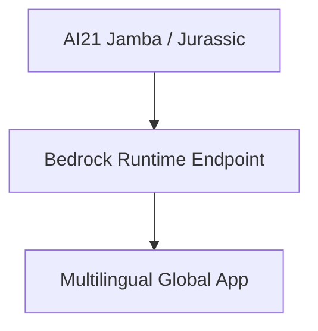

# 28. AI21 on Amazon Bedrock - Foundation Models & AI Systems

<VideoSection title="AI21 on Amazon Bedrock - Foundation Models & AI Systems" youtubeId="BNHkZyEpF1g" duration="01:49" motto="Official AWS Bedrock Video Tutorial tailored to AI21 on Amazon Bedrock - Foundation Models & AI Systems with clickable timestamped transcripts." whatItDoes="Integrates topic-matched AWS Bedrock video lessons with synchronized transcripts and instant-jump topic bookmarks." clickInstructions="Click the video play button to start watching, or click any timestamp in the interactive transcript to jump directly to that topic." transcript=[{"time": "00:00", "text": "Introduction to AI21 on Amazon Bedrock - Foundation Models & AI Systems in Amazon Bedrock.", "timestamp": 0}, {"time": "01:15", "text": "Technical deep-dive and operational breakdown of AI21 on Amazon Bedrock - Foundation Models & AI Systems.", "timestamp": 75}, {"time": "02:30", "text": "Production implementation and enterprise best practices for AI21 on Amazon Bedrock - Foundation Models & AI Systems.", "timestamp": 150}] bookmarks=[{"title": "Introduction & Key Concepts", "time": "00:00", "timestamp": 0}, {"title": "Technical Walkthrough", "time": "01:15", "timestamp": 75}, {"title": "Production Best Practices", "time": "02:30", "timestamp": 150}] kbId="doc_aws_bedrock_production" />

## TOPIC OVERVIEW
Overview of AI21 Labs Jurassic-2 and Jamba SSM-Transformer hybrid foundation models on Bedrock.

## KEY ARCHITECTURAL & OPERATIONAL CONCEPTS
- **Jamba Hybrid Model**:  State-of-the-art SSM-Transformer architecture for ultra-long context windows.
- **Multilingual Support**:  Strong performance across Spanish, French, German, and Portuguese.
- **Text Reformulation**:  Advanced paraphrasing, grammar correction, and tone adjustment APIs.

> [!NOTE]
> All model integrations and workflows in Amazon Bedrock strictly observe AWS security boundaries, KMS key encryption, and zero data retention policies!

## VISUAL WORKFLOW & ARCHITECTURE DIAGRAM

## ENTERPRISE BEST PRACTICES
1. **Decoupled Architecture**: Use the standard Boto3 Converse API to avoid binding client code to a specific model provider.
2. **Safety First**: Attach Bedrock Guardrails to all model invocation requests to prevent PII leaks and prompt injection attacks.
3. **Observability**: Enable CloudWatch model invocation logging for compliance tracking and cost monitoring.
