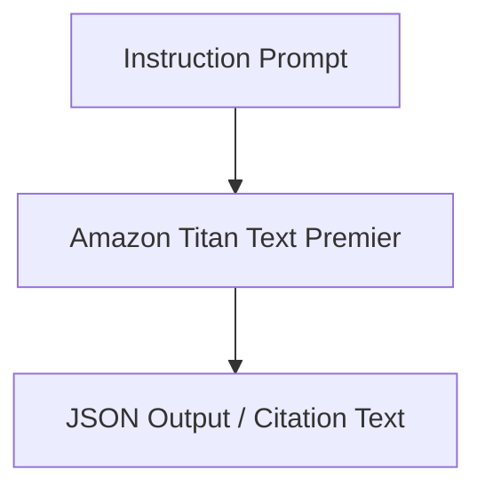

# 32. Hands-On Demo: Put Amazon Titan Text Premier to Work

<VideoSection title="Demo: Put Amazon Titan Text Premier to Work for Enterprise" youtubeId="T4kSNEeUxc4" duration="01:31" motto="Official AWS Bedrock Video Tutorial tailored to Demo: Put Amazon Titan Text Premier to Work for Enterprise with clickable timestamped transcripts." whatItDoes="Integrates topic-matched AWS Bedrock video lessons with synchronized transcripts and instant-jump topic bookmarks." clickInstructions="Click the video play button to start watching, or click any timestamp in the interactive transcript to jump directly to that topic." transcript=[{"time": "00:00", "text": "Introduction to Demo: Put Amazon Titan Text Premier to Work for Enterprise in Amazon Bedrock.", "timestamp": 0}, {"time": "01:15", "text": "Technical deep-dive and operational breakdown of Demo: Put Amazon Titan Text Premier to Work for Enterprise.", "timestamp": 75}, {"time": "02:30", "text": "Production implementation and enterprise best practices for Demo: Put Amazon Titan Text Premier to Work for Enterprise.", "timestamp": 150}] bookmarks=[{"title": "Introduction & Key Concepts", "time": "00:00", "timestamp": 0}, {"title": "Technical Walkthrough", "time": "01:15", "timestamp": 75}, {"title": "Production Best Practices", "time": "02:30", "timestamp": 150}] kbId="doc_aws_bedrock_production" />

## TOPIC OVERVIEW
Demonstration of deploying Amazon Titan Text Premier for enterprise RAG and text generation workflows.

## KEY ARCHITECTURAL & OPERATIONAL CONCEPTS
- **Premier Model Tuning**:  Optimized specifically for instruction-following and structured output.
- **Boto3 Converse API**:  Calling amazon.titan-text-premier-v1
- **Integration with Knowledge Bases**:  Out-of-the-box support for RetrieveAndGenerate requests.

> [!NOTE]
> All model integrations and workflows in Amazon Bedrock strictly observe AWS security boundaries, KMS key encryption, and zero data retention policies!

## VISUAL WORKFLOW & ARCHITECTURE DIAGRAM

## ENTERPRISE BEST PRACTICES
1. **Decoupled Architecture**: Use the standard Boto3 Converse API to avoid binding client code to a specific model provider.
2. **Safety First**: Attach Bedrock Guardrails to all model invocation requests to prevent PII leaks and prompt injection attacks.
3. **Observability**: Enable CloudWatch model invocation logging for compliance tracking and cost monitoring.
