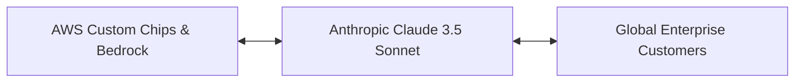

# 33. NYC Summit 2024 - AWS & Anthropic: Unleashing the Power of Claude

<VideoSection title="NYC Summit 2024 - AWS & Anthropic: Unleashing the Power of Claude" youtubeId="i90aQnOeReo" duration="05:46" motto="Official AWS Bedrock Video Tutorial tailored to NYC Summit 2024 - AWS & Anthropic: Unleashing the Power of Claude with clickable timestamped transcripts." whatItDoes="Integrates topic-matched AWS Bedrock video lessons with synchronized transcripts and instant-jump topic bookmarks." clickInstructions="Click the video play button to start watching, or click any timestamp in the interactive transcript to jump directly to that topic." transcript=[{"time": "00:00", "text": "Introduction to NYC Summit 2024 - AWS & Anthropic: Unleashing the Power of Claude in Amazon Bedrock.", "timestamp": 0}, {"time": "01:15", "text": "Technical deep-dive and operational breakdown of NYC Summit 2024 - AWS & Anthropic: Unleashing the Power of Claude.", "timestamp": 75}, {"time": "02:30", "text": "Production implementation and enterprise best practices for NYC Summit 2024 - AWS & Anthropic: Unleashing the Power of Claude.", "timestamp": 150}] bookmarks=[{"title": "Introduction & Key Concepts", "time": "00:00", "timestamp": 0}, {"title": "Technical Walkthrough", "time": "01:15", "timestamp": 75}, {"title": "Production Best Practices", "time": "02:30", "timestamp": 150}] kbId="doc_aws_bedrock_production" />

## TOPIC OVERVIEW
Keynote insights from AWS NYC Summit 2024 highlighting strategic AWS & Anthropic partnership and Claude 3.5 Sonnet innovations.

## KEY ARCHITECTURAL & OPERATIONAL CONCEPTS
- **Strategic Alliance**:  Deep co-design of AWS Trainium/Inferentia hardware with Anthropic models.
- **Claude 3.5 Sonnet Milestones**:  Industry benchmark breakthroughs in coding and agentic reasoning.
- **Enterprise Deployment Scale**:  Millions of daily API calls processed serverlessly on Bedrock.

> [!NOTE]
> All model integrations and workflows in Amazon Bedrock strictly observe AWS security boundaries, KMS key encryption, and zero data retention policies!

## VISUAL WORKFLOW & ARCHITECTURE DIAGRAM

## ENTERPRISE BEST PRACTICES
1. **Decoupled Architecture**: Use the standard Boto3 Converse API to avoid binding client code to a specific model provider.
2. **Safety First**: Attach Bedrock Guardrails to all model invocation requests to prevent PII leaks and prompt injection attacks.
3. **Observability**: Enable CloudWatch model invocation logging for compliance tracking and cost monitoring.
