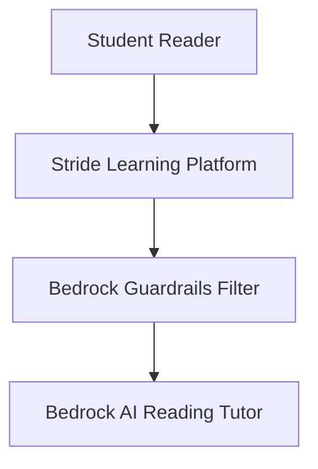

# 34. How Stride Learning Transforms Reading with AI-Powered Bedrock

<VideoSection title="How Stride Learning Transforms Reading with AI-Powered Bedrock" youtubeId="0C8yS5DoZps" duration="01:44" motto="Official AWS Bedrock Video Tutorial tailored to How Stride Learning Transforms Reading with AI-Powered Bedrock with clickable timestamped transcripts." whatItDoes="Integrates topic-matched AWS Bedrock video lessons with synchronized transcripts and instant-jump topic bookmarks." clickInstructions="Click the video play button to start watching, or click any timestamp in the interactive transcript to jump directly to that topic." transcript=[{"time": "00:00", "text": "Introduction to How Stride Learning Transforms Reading with AI-Powered Bedrock in Amazon Bedrock.", "timestamp": 0}, {"time": "01:15", "text": "Technical deep-dive and operational breakdown of How Stride Learning Transforms Reading with AI-Powered Bedrock.", "timestamp": 75}, {"time": "02:30", "text": "Production implementation and enterprise best practices for How Stride Learning Transforms Reading with AI-Powered Bedrock.", "timestamp": 150}] bookmarks=[{"title": "Introduction & Key Concepts", "time": "00:00", "timestamp": 0}, {"title": "Technical Walkthrough", "time": "01:15", "timestamp": 75}, {"title": "Production Best Practices", "time": "02:30", "timestamp": 150}] kbId="doc_aws_bedrock_production" />

## TOPIC OVERVIEW
Customer success story showing how Stride Learning builds interactive AI reading tutors for K-12 students using Bedrock.

## KEY ARCHITECTURAL & OPERATIONAL CONCEPTS
- **EdTech Innovation**:  Adaptive reading prompts personalized to student comprehension levels.
- **AI Safety Filters**:  Enforcing strict Bedrock Guardrails to keep all content child-appropriate.
- **Scalable Learning**:  Supporting thousands of simultaneous online student sessions.

> [!NOTE]
> All model integrations and workflows in Amazon Bedrock strictly observe AWS security boundaries, KMS key encryption, and zero data retention policies!

## VISUAL WORKFLOW & ARCHITECTURE DIAGRAM

## ENTERPRISE BEST PRACTICES
1. **Decoupled Architecture**: Use the standard Boto3 Converse API to avoid binding client code to a specific model provider.
2. **Safety First**: Attach Bedrock Guardrails to all model invocation requests to prevent PII leaks and prompt injection attacks.
3. **Observability**: Enable CloudWatch model invocation logging for compliance tracking and cost monitoring.
