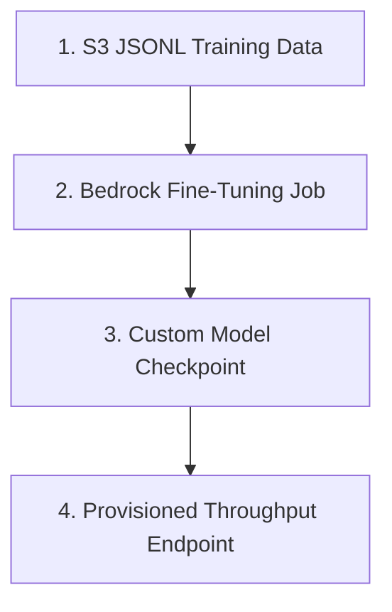

# 36. Hands-On Demo: Fine-tuning for Anthropic's Claude 3 Haiku in Bedrock

<VideoSection title="Demo: Fine-tuning for Anthropic's Claude 3 Haiku in Amazon Bedrock" youtubeId="BfURFJbEQLA" duration="23:06" motto="Official AWS Bedrock Video Tutorial tailored to Demo: Fine-tuning for Anthropic's Claude 3 Haiku in Amazon Bedrock with clickable timestamped transcripts." whatItDoes="Integrates topic-matched AWS Bedrock video lessons with synchronized transcripts and instant-jump topic bookmarks." clickInstructions="Click the video play button to start watching, or click any timestamp in the interactive transcript to jump directly to that topic." transcript=[{"time": "00:00", "text": "Introduction to Demo: Fine-tuning for Anthropic's Claude 3 Haiku in Amazon Bedrock in Amazon Bedrock.", "timestamp": 0}, {"time": "01:15", "text": "Technical deep-dive and operational breakdown of Demo: Fine-tuning for Anthropic's Claude 3 Haiku in Amazon Bedrock.", "timestamp": 75}, {"time": "02:30", "text": "Production implementation and enterprise best practices for Demo: Fine-tuning for Anthropic's Claude 3 Haiku in Amazon Bedrock.", "timestamp": 150}] bookmarks=[{"title": "Introduction & Key Concepts", "time": "00:00", "timestamp": 0}, {"title": "Technical Walkthrough", "time": "01:15", "timestamp": 75}, {"title": "Production Best Practices", "time": "02:30", "timestamp": 150}] kbId="doc_aws_bedrock_production" />

## TOPIC OVERVIEW
Deep-dive hands-on walkthrough of creating custom fine-tuning training jobs for Anthropic Claude 3 Haiku inside Amazon Bedrock.

## KEY ARCHITECTURAL & OPERATIONAL CONCEPTS
- **Dataset Preparation**:  Formatting JSONL training datasets in S3 for fine-tuning.
- **Fine-Tuning Job Creation**:  Configuring hyper-parameters and starting model training in AWS Console.
- **Provisioned Throughput Deployment**:  Deploying custom fine-tuned model checkpoints to dedicated endpoints.

> [!NOTE]
> All model integrations and workflows in Amazon Bedrock strictly observe AWS security boundaries, KMS key encryption, and zero data retention policies!

## VISUAL WORKFLOW & ARCHITECTURE DIAGRAM

## ENTERPRISE BEST PRACTICES
1. **Decoupled Architecture**: Use the standard Boto3 Converse API to avoid binding client code to a specific model provider.
2. **Safety First**: Attach Bedrock Guardrails to all model invocation requests to prevent PII leaks and prompt injection attacks.
3. **Observability**: Enable CloudWatch model invocation logging for compliance tracking and cost monitoring.
