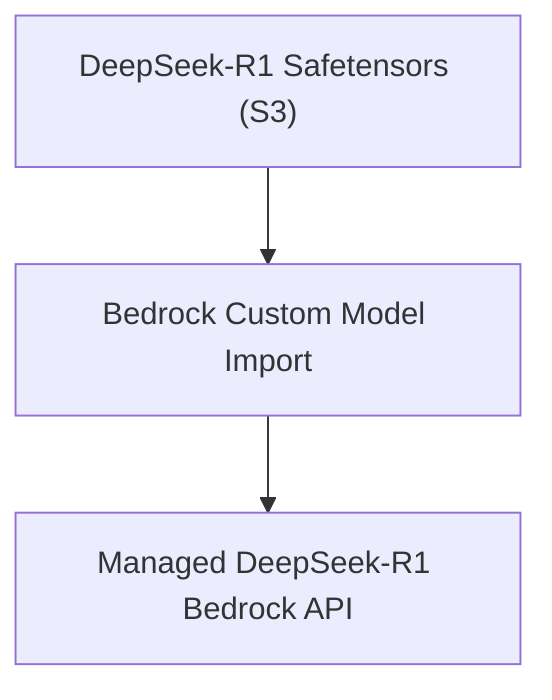

# 37. Deploy DeepSeek-R1 Models with Amazon Bedrock Custom Model Import

<VideoSection title="Deploy DeepSeek-R1 models with Amazon Bedrock Custom Model Import" youtubeId="1aq_ju70qHQ" duration="03:01" motto="Official AWS Bedrock Video Tutorial tailored to Deploy DeepSeek-R1 models with Amazon Bedrock Custom Model Import with clickable timestamped transcripts." whatItDoes="Integrates topic-matched AWS Bedrock video lessons with synchronized transcripts and instant-jump topic bookmarks." clickInstructions="Click the video play button to start watching, or click any timestamp in the interactive transcript to jump directly to that topic." transcript=[{"time": "00:00", "text": "Introduction to Deploy DeepSeek-R1 models with Amazon Bedrock Custom Model Import in Amazon Bedrock.", "timestamp": 0}, {"time": "01:15", "text": "Technical deep-dive and operational breakdown of Deploy DeepSeek-R1 models with Amazon Bedrock Custom Model Import.", "timestamp": 75}, {"time": "02:30", "text": "Production implementation and enterprise best practices for Deploy DeepSeek-R1 models with Amazon Bedrock Custom Model Import.", "timestamp": 150}] bookmarks=[{"title": "Introduction & Key Concepts", "time": "00:00", "timestamp": 0}, {"title": "Technical Walkthrough", "time": "01:15", "timestamp": 75}, {"title": "Production Best Practices", "time": "02:30", "timestamp": 150}] kbId="doc_aws_bedrock_production" />

## TOPIC OVERVIEW
Learn how to import and deploy DeepSeek-R1 reasoning model weights into Amazon Bedrock using Custom Model Import.

## KEY ARCHITECTURAL & OPERATIONAL CONCEPTS
- **Reasoning Models on Bedrock**:  Hosting open reasoning models with zero infrastructure management.
- **Custom Model Import Pipeline**:  Packaging Safetensors model files in S3 and creating Bedrock model import jobs.
- **Enterprise Control**:  Applying Bedrock Guardrails and CloudWatch metrics to imported DeepSeek-R1 models.

> [!NOTE]
> All model integrations and workflows in Amazon Bedrock strictly observe AWS security boundaries, KMS key encryption, and zero data retention policies!

## VISUAL WORKFLOW & ARCHITECTURE DIAGRAM

## ENTERPRISE BEST PRACTICES
1. **Decoupled Architecture**: Use the standard Boto3 Converse API to avoid binding client code to a specific model provider.
2. **Safety First**: Attach Bedrock Guardrails to all model invocation requests to prevent PII leaks and prompt injection attacks.
3. **Observability**: Enable CloudWatch model invocation logging for compliance tracking and cost monitoring.
