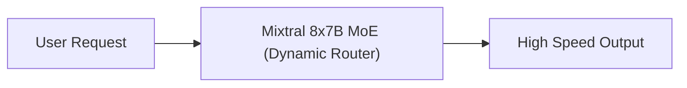

# 38. Mistral AI in Amazon Bedrock - Empowering Enterprises

<VideoSection title="Mistral AI in Amazon Bedrock - Empowering Enterprises" youtubeId="ePY2ryoD5bE" duration="01:21" motto="Official AWS Bedrock Video Tutorial tailored to Mistral AI in Amazon Bedrock - Empowering Enterprises with clickable timestamped transcripts." whatItDoes="Integrates topic-matched AWS Bedrock video lessons with synchronized transcripts and instant-jump topic bookmarks." clickInstructions="Click the video play button to start watching, or click any timestamp in the interactive transcript to jump directly to that topic." transcript=[{"time": "00:00", "text": "Introduction to Mistral AI in Amazon Bedrock - Empowering Enterprises in Amazon Bedrock.", "timestamp": 0}, {"time": "01:15", "text": "Technical deep-dive and operational breakdown of Mistral AI in Amazon Bedrock - Empowering Enterprises.", "timestamp": 75}, {"time": "02:30", "text": "Production implementation and enterprise best practices for Mistral AI in Amazon Bedrock - Empowering Enterprises.", "timestamp": 150}] bookmarks=[{"title": "Introduction & Key Concepts", "time": "00:00", "timestamp": 0}, {"title": "Technical Walkthrough", "time": "01:15", "timestamp": 75}, {"title": "Production Best Practices", "time": "02:30", "timestamp": 150}] kbId="doc_aws_bedrock_production" />

## TOPIC OVERVIEW
Overview of Mistral 7B, Mixtral 8x7B Sparse Mixture-of-Experts (MoE), and Mistral Large models on Bedrock.

## KEY ARCHITECTURAL & OPERATIONAL CONCEPTS
- **Mixtral 8x7B MoE**:  Sparse Mixture-of-Experts architecture delivering ultra-high throughput at low inference cost.
- **Mistral Large**:  Flagship reasoning model for multilingual comprehension and complex logic.
- **Enterprise Security**:  Deploying European leading AI models under AWS IAM & VPC compliance.

> [!NOTE]
> All model integrations and workflows in Amazon Bedrock strictly observe AWS security boundaries, KMS key encryption, and zero data retention policies!

## VISUAL WORKFLOW & ARCHITECTURE DIAGRAM

## ENTERPRISE BEST PRACTICES
1. **Decoupled Architecture**: Use the standard Boto3 Converse API to avoid binding client code to a specific model provider.
2. **Safety First**: Attach Bedrock Guardrails to all model invocation requests to prevent PII leaks and prompt injection attacks.
3. **Observability**: Enable CloudWatch model invocation logging for compliance tracking and cost monitoring.
