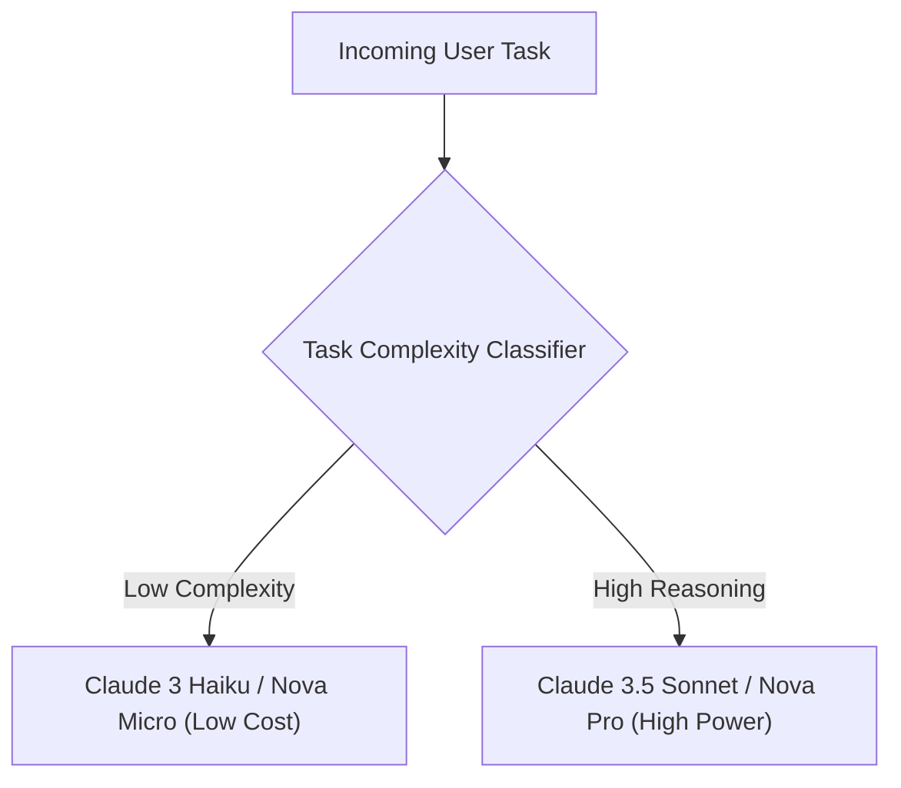

# 39. Amazon Bedrock – Model Choice & Model Selection Strategy

<VideoSection title="Amazon Bedrock – Model Choice | Amazon Web Services" youtubeId="58vXS9gz5wI" duration="01:37" motto="Official AWS Bedrock Video Tutorial tailored to Amazon Bedrock – Model Choice | Amazon Web Services with clickable timestamped transcripts." whatItDoes="Integrates topic-matched AWS Bedrock video lessons with synchronized transcripts and instant-jump topic bookmarks." clickInstructions="Click the video play button to start watching, or click any timestamp in the interactive transcript to jump directly to that topic." transcript=[{"time": "00:00", "text": "Introduction to Amazon Bedrock \u2013 Model Choice | Amazon Web Services in Amazon Bedrock.", "timestamp": 0}, {"time": "01:15", "text": "Technical deep-dive and operational breakdown of Amazon Bedrock \u2013 Model Choice | Amazon Web Services.", "timestamp": 75}, {"time": "02:30", "text": "Production implementation and enterprise best practices for Amazon Bedrock \u2013 Model Choice | Amazon Web Services.", "timestamp": 150}] bookmarks=[{"title": "Introduction & Key Concepts", "time": "00:00", "timestamp": 0}, {"title": "Technical Walkthrough", "time": "01:15", "timestamp": 75}, {"title": "Production Best Practices", "time": "02:30", "timestamp": 150}] kbId="doc_aws_bedrock_production" />

## TOPIC OVERVIEW
Strategic framework for evaluating and selecting the optimal foundation model provider for your business use case.

## KEY ARCHITECTURAL & OPERATIONAL CONCEPTS
- **Model Selection Criteria**:  Context window size, cost per token, latency, modality (text/vision/image), and reasoning score.
- **Multi-Model Routing Architecture**:  Intelligently routing simple queries to Haiku/Express and complex tasks to Sonnet/Premier.
- **Zero Vendor Lock-In**:  Decoupled application code allows instant model swapping.

> [!NOTE]
> All model integrations and workflows in Amazon Bedrock strictly observe AWS security boundaries, KMS key encryption, and zero data retention policies!

## VISUAL WORKFLOW & ARCHITECTURE DIAGRAM

## ENTERPRISE BEST PRACTICES
1. **Decoupled Architecture**: Use the standard Boto3 Converse API to avoid binding client code to a specific model provider.
2. **Safety First**: Attach Bedrock Guardrails to all model invocation requests to prevent PII leaks and prompt injection attacks.
3. **Observability**: Enable CloudWatch model invocation logging for compliance tracking and cost monitoring.
