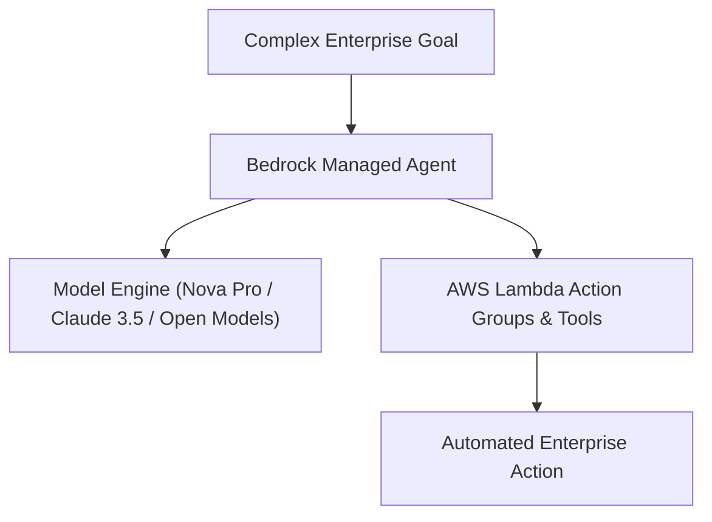

# 40. Amazon Bedrock Managed Agents, Powered by OpenAI, Nova, & Open Models

<VideoSection title="Amazon Bedrock Managed Agents, Powered by OpenAI, Nova, & Open Models" youtubeId="L72vKGogmV0" duration="01:28" motto="Official AWS Bedrock Video Tutorial tailored to Amazon Bedrock Managed Agents, Powered by OpenAI, Nova, & Open Models with clickable timestamped transcripts." whatItDoes="Integrates topic-matched AWS Bedrock video lessons with synchronized transcripts and instant-jump topic bookmarks." clickInstructions="Click the video play button to start watching, or click any timestamp in the interactive transcript to jump directly to that topic." transcript=[{"time": "00:00", "text": "Introduction to Amazon Bedrock Managed Agents, Powered by OpenAI, Nova, & Open Models in Amazon Bedrock.", "timestamp": 0}, {"time": "01:15", "text": "Technical deep-dive and operational breakdown of Amazon Bedrock Managed Agents, Powered by OpenAI, Nova, & Open Models.", "timestamp": 75}, {"time": "02:30", "text": "Production implementation and enterprise best practices for Amazon Bedrock Managed Agents, Powered by OpenAI, Nova, & Open Models.", "timestamp": 150}] bookmarks=[{"title": "Introduction & Key Concepts", "time": "00:00", "timestamp": 0}, {"title": "Technical Walkthrough", "time": "01:15", "timestamp": 75}, {"title": "Production Best Practices", "time": "02:30", "timestamp": 150}] kbId="doc_aws_bedrock_production" />

## TOPIC OVERVIEW
Explore the next generation of Amazon Bedrock Managed Agents supporting multi-model backends including Amazon Nova, OpenAI models, and open-weights.

## KEY ARCHITECTURAL & OPERATIONAL CONCEPTS
- **Multi-Model Agent Backends**:  Configure agents powered by Amazon Nova, Anthropic Claude, or custom imported model backends.
- **Autonomous Tool Execution**:  Dynamic tool calling, memory management, and multi-step plan execution.
- **Enterprise Governance**:  Unified observability, logging, and guardrails across agent orchestrations.

> [!NOTE]
> All model integrations and workflows in Amazon Bedrock strictly observe AWS security boundaries, KMS key encryption, and zero data retention policies!

## VISUAL WORKFLOW & ARCHITECTURE DIAGRAM

## ENTERPRISE BEST PRACTICES
1. **Decoupled Architecture**: Use the standard Boto3 Converse API to avoid binding client code to a specific model provider.
2. **Safety First**: Attach Bedrock Guardrails to all model invocation requests to prevent PII leaks and prompt injection attacks.
3. **Observability**: Enable CloudWatch model invocation logging for compliance tracking and cost monitoring.
