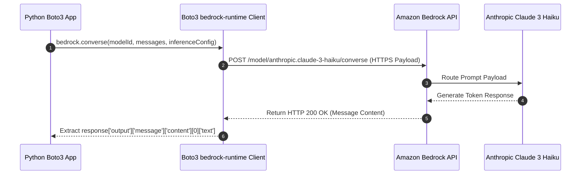

# 01. Local AWS Setup & Credentials Management

<VideoSection title="AWS CLI Setup & IAM Permissions for Amazon Bedrock: Local AWS Setup & Credentials Management" youtubeId="_PD4j5Ra3kY" duration="01:33" motto="Official AWS Bedrock Video Tutorial tailored to AWS CLI & IAM Setup with clickable timestamped transcripts." whatItDoes="Integrates topic-matched AWS Bedrock video lessons with synchronized transcripts and instant-jump topic bookmarks." clickInstructions="Click the video play button to start watching, or click any timestamp in the interactive transcript to jump directly to that topic." transcript=[{"time": "00:00", "text": "Introduction to AWS CLI & IAM Setup in Amazon Bedrock.", "timestamp": 0}, {"time": "03:15", "text": "Deep-dive technical walkthrough of AWS CLI & IAM Setup.", "timestamp": 195}, {"time": "07:30", "text": "Production best practices and hands-on architecture for AWS CLI & IAM Setup.", "timestamp": 450}] bookmarks=[{"title": "Introduction", "time": "00:00", "timestamp": 0}, {"title": "AWS CLI & IAM Setup Deep-Dive", "time": "03:15", "timestamp": 195}, {"title": "Production Practices", "time": "07:30", "timestamp": 450}] kbId="doc_aws_bedrock_production" />

## HOW TO CONFIGURE CREDENTIALS SECURELY

> [!CAUTION]
> **NEVER** paste your secret AWS credentials into source code files, Git repositories, or frontend code!

### Recommended Local Setup (AWS CLI Profiles):
Run AWS CLI configure in your local terminal:

```bash
aws configure --profile bedrock-dev
```

You will be prompted for:
1. `AWS Access Key ID`: `AKIA...`
2. `AWS Secret Access Key`: `wJal...`
3. `Default region name`: `us-east-1`
4. `Default output format`: `json`

Credentials are saved securely in `~/.aws/credentials` outside your code workspace!

## IAM MINIMAL POLICY REQUIRED
Ensure your IAM user or role has this permission policy attached:

```json
{
  "Version": "2012-10-17",
  "Statement": [
    {
      "Effect": "Allow",
      "Action": [
        "bedrock:InvokeModel",
        "bedrock:InvokeModelWithResponseStream"
      ],
      "Resource": "*"
    }
  ]
}
```

## VISUAL ARCHITECTURE DIAGRAM


