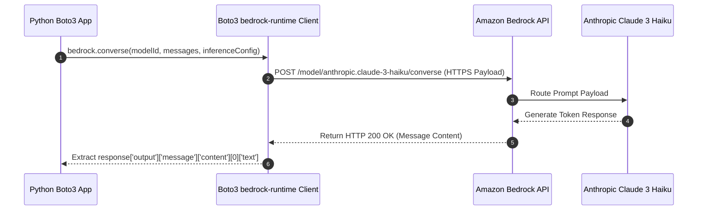

# 02. Python & Boto3 Environment Setup

<VideoSection title="Python Boto3 SDK Setup & Bedrock Runtime Initialization: Python & Boto3 Environment Setup" youtubeId="QSDIKakB8qs" duration="10:15" motto="Official AWS Bedrock Video Tutorial tailored to Boto3 SDK Setup with clickable timestamped transcripts." whatItDoes="Integrates topic-matched AWS Bedrock video lessons with synchronized transcripts and instant-jump topic bookmarks." clickInstructions="Click the video play button to start watching, or click any timestamp in the interactive transcript to jump directly to that topic." transcript=[{"time": "00:00", "text": "Introduction to Boto3 SDK Setup in Amazon Bedrock.", "timestamp": 0}, {"time": "03:15", "text": "Deep-dive technical walkthrough of Boto3 SDK Setup.", "timestamp": 195}, {"time": "07:30", "text": "Production best practices and hands-on architecture for Boto3 SDK Setup.", "timestamp": 450}] bookmarks=[{"title": "Introduction", "time": "00:00", "timestamp": 0}, {"title": "Boto3 SDK Setup Deep-Dive", "time": "03:15", "timestamp": 195}, {"title": "Production Practices", "time": "07:30", "timestamp": 450}] kbId="doc_aws_bedrock_production" />

## INSTALLING REQUIRED PACKAGES
Install `boto3` (the official AWS SDK for Python) using pip:

```bash
pip install boto3 botocore
```

## INITIALIZING BEDROCK RUNTIME CLIENT
In Python, initialize the client targeting `bedrock-runtime`:

```python
import boto3

# Boto3 client automatically reads credentials from ~/.aws/credentials or environment variables
bedrock = boto3.client(
    service_name='bedrock-runtime',
    region_name='us-east-1'
)

print("[SUCCESS] Bedrock Runtime client initialized cleanly.")
```

> [!NOTE]
> `bedrock` service is used for control plane (model listing/customization), while `bedrock-runtime` is used for invoking models!

## VISUAL ARCHITECTURE DIAGRAM


