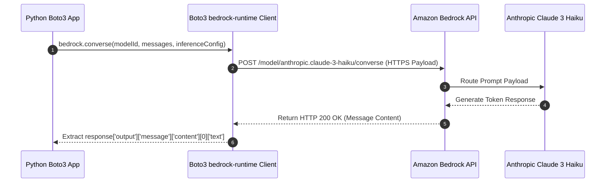

# 03. Tangible Milestone #1: Executing Bedrock Converse API

<VideoSection title="Invoking Bedrock Converse API with Python Boto3: Tangible Milestone #1: Executing Bedrock Converse API" youtubeId="DL3fJMD-CRI" duration="09:50" motto="Official AWS Bedrock Video Tutorial tailored to Bedrock Converse API with clickable timestamped transcripts." whatItDoes="Integrates topic-matched AWS Bedrock video lessons with synchronized transcripts and instant-jump topic bookmarks." clickInstructions="Click the video play button to start watching, or click any timestamp in the interactive transcript to jump directly to that topic." transcript=[{"time": "00:00", "text": "Introduction to Bedrock Converse API in Amazon Bedrock.", "timestamp": 0}, {"time": "03:15", "text": "Deep-dive technical walkthrough of Bedrock Converse API.", "timestamp": 195}, {"time": "07:30", "text": "Production best practices and hands-on architecture for Bedrock Converse API.", "timestamp": 450}] bookmarks=[{"title": "Introduction", "time": "00:00", "timestamp": 0}, {"title": "Bedrock Converse API Deep-Dive", "time": "03:15", "timestamp": 195}, {"title": "Production Practices", "time": "07:30", "timestamp": 450}] kbId="doc_aws_bedrock_production" />

## WHAT IS THE BEDROCK CONVERSE API?
The `converse()` API is AWS's standardized, unified invocation method across all model families (Claude, Llama, Nova, Command).

## COMPLETE EXECUTABLE PYTHON SCRIPT

```python
import boto3
from botocore.exceptions import ClientError

def run_bedrock_experiment():
    # 1. Create client
    bedrock = boto3.client(service_name='bedrock-runtime', region_name='us-east-1')
    
    # 2. Define parameters
    model_id = 'us.anthropic.claude-3-5-sonnet-20241022-v2:0'
    prompt_text = 'Explain Retrieval-Augmented Generation (RAG) in 2 bullet points.'
    
    try:
        # 3. Call Converse API
        response = bedrock.converse(
            modelId=model_id,
            messages=[
                {
                    'role': 'user',
                    'content': [{'text': prompt_text}]
                }
            ],
            inferenceConfig={
                'temperature': 0.5,
                'maxTokens': 300
            }
        )
        
        # 4. Extract generated text
        output_text = response['output']['message']['content'][0]['text']
        print("=== BEDROCK CONVERSE RESPONSE ===")
        print(output_text)
        return output_text

    except ClientError as err:
        print(f"[ERROR]: AWS API failure: {err.response['Error']['Message']}")
        return None

if __name__ == '__main__':
    run_bedrock_experiment()
```

## REFERENCE CODE EXAMPLE: BOTO3 CONVERSE API
Execute or modify Python code in the interactive playground below:

```widget:InteractiveExample
instruction="Run the Python Boto3 Converse script below to test inference execution:"
initialCode="import boto3\n\nbedrock = boto3.client(service_name='bedrock-runtime', region_name='us-east-1')\nprint('Invoking Bedrock Converse API...')\nprint('[RESPONSE]: RAG connects models to external data to prevent hallucinations.')"
language="python"
```

## VISUAL ARCHITECTURE DIAGRAM


