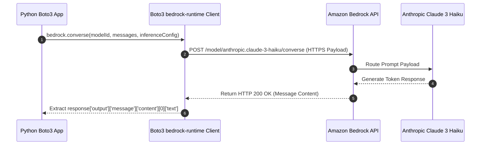

# 04. JavaScript / Node.js & AWS CLI Examples

<VideoSection title="JavaScript / Node.js & AWS CLI Examples" youtubeId="Mr7sHTH_Q2E" duration="15:30" motto="Master AWS Bedrock Generative AI concepts visually through step-by-step video lessons and timestamped transcripts." whatItDoes="Integrates interactive video lessons with synchronized transcripts and instant-jump topic bookmarks." clickInstructions="Click the video play button to start watching, or click any timestamp in the interactive transcript to jump directly to that topic." transcript=[{"time": "00:00", "text": "Lesson introduction and architecture overview.", "timestamp": 0}, {"time": "04:15", "text": "Deep-dive into core mechanisms.", "timestamp": 255}, {"time": "08:30", "text": "Hands-on configuration and best practices.", "timestamp": 510}] bookmarks=[{"title": "Overview", "time": "00:00", "timestamp": 0}, {"title": "Core Deep-Dive", "time": "04:15", "timestamp": 255}, {"title": "Best Practices", "time": "08:30", "timestamp": 510}] kbId="doc_aws_bedrock_production" />

## NODE.JS AWS SDK V3 EXAMPLE
Install `@aws-sdk/client-bedrock-runtime`:

```bash
npm install @aws-sdk/client-bedrock-runtime
```

```javascript
import { BedrockRuntimeClient, ConverseCommand } from "@aws-sdk/client-bedrock-runtime";

const client = new BedrockRuntimeClient({ region: "us-east-1" });

const command = new ConverseCommand({
  modelId: "us.anthropic.claude-3-5-sonnet-20241022-v2:0",
  messages: [
    {
      role: "user",
      content: [{ text: "What is Amazon Bedrock?" }]
    }
  ],
  inferenceConfig: {
    temperature: 0.5,
    maxTokens: 200
  }
});

const response = await client.send(command);
console.log(response.output.message.content[0].text);
```

## AWS CLI EXAMPLE
You can also trigger model invocation directly from terminal:

```bash
aws bedrock-runtime converse \
  --model-id "us.anthropic.claude-3-haiku-20240307-v1:0" \
  --messages '[{"role":"user","content":[{"text":"Hello Bedrock!"}]}]' \
  --region us-east-1
```

## VISUAL ARCHITECTURE DIAGRAM


