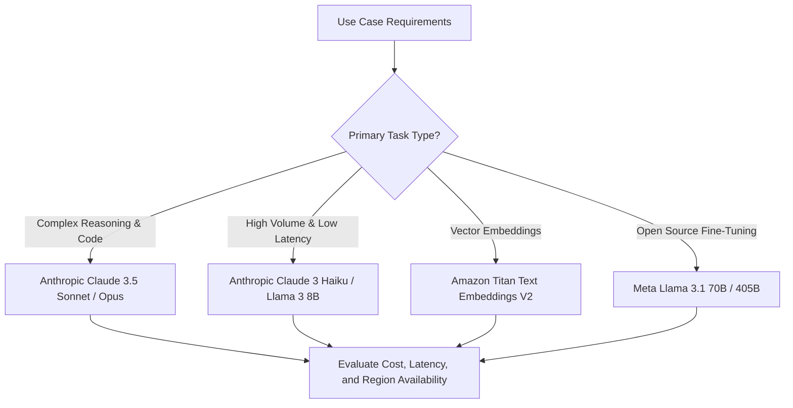

# 01. Comparing Model Families on Bedrock

<VideoSection title="Exploring Foundation Model Families on Amazon Bedrock: Comparing Model Families on Bedrock" youtubeId="L_4K8_2zX" duration="12:43" motto="Official AWS Bedrock Video Tutorial tailored to Model Families with clickable timestamped transcripts." whatItDoes="Integrates topic-matched AWS Bedrock video lessons with synchronized transcripts and instant-jump topic bookmarks." clickInstructions="Click the video play button to start watching, or click any timestamp in the interactive transcript to jump directly to that topic." transcript=[{"time": "00:00", "text": "Introduction to Model Families in Amazon Bedrock.", "timestamp": 0}, {"time": "03:15", "text": "Deep-dive technical walkthrough of Model Families.", "timestamp": 195}, {"time": "07:30", "text": "Production best practices and hands-on architecture for Model Families.", "timestamp": 450}] bookmarks=[{"title": "Introduction", "time": "00:00", "timestamp": 0}, {"title": "Model Families Deep-Dive", "time": "03:15", "timestamp": 195}, {"title": "Production Practices", "time": "07:30", "timestamp": 450}] kbId="doc_aws_bedrock_production" />

## WHY DIFFERENT MODEL FAMILIES EXIST
No single AI model is optimal for every workload.
- Complex coding requires high reasoning capacity.
- Real-time chat requires ultra-low latency.
- Data search requires text embedding vectors.

```
                  ┌───────────────────────────────┐
                  │ Model Selection Trade-Offs    │
                  └───────────────┬───────────────┘
                                  │
         ┌────────────────────────┼────────────────────────┐
         ▼                        ▼                        ▼
┌───────────────────┐    ┌───────────────────┐    ┌───────────────────┐
│ High Reasoning    │    │ Ultra Fast        │    │ Open Weights      │
│ (Claude 3.5 Sonnet)│    │ (Claude 3 Haiku)  │    │ (Llama 3.1 70B)   │
└───────────────────┘    └───────────────────┘    └───────────────────┘
```

> [!TIP]
> Use the config-driven comparison explorer below to evaluate speed, context length, and modalities across model providers:

```widget:ModelComparisonExplorer
{
  "modelCatalog": [
    {
      "modelId": "anthropic.claude-3-5-sonnet-20241022-v2:0",
      "provider": "Anthropic",
      "contextWindow": "200,000 Tokens",
      "bestUseCases": ["Coding", "Complex Multimodal Reasoning", "Agentic Workflows"]
    },
    {
      "modelId": "amazon.nova-pro-v1:0",
      "provider": "Amazon",
      "contextWindow": "300,000 Tokens",
      "bestUseCases": ["Fast Enterprise Multimodal Tasks", "High Throughput Processing"]
    },
    {
      "modelId": "meta.llama3-3-70b-instruct-v1:0",
      "provider": "Meta",
      "contextWindow": "128,000 Tokens",
      "bestUseCases": ["Open Weights", "General Text Generation", "Custom Fine-Tuning"]
    }
  ]
}
```

## VISUAL ARCHITECTURE DIAGRAM


