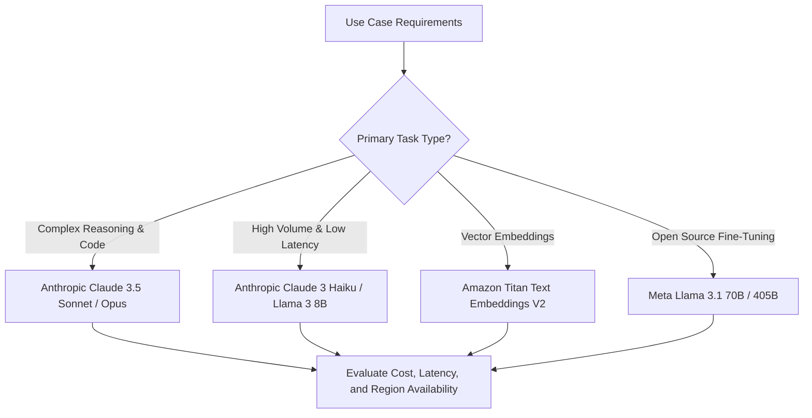

# 02. Text, Vision, Multimodal & Reasoning Capabilities

<VideoSection title="Text, Vision Multimodal & Deep Reasoning Models: Text, Vision, Multimodal & Reasoning Capabilities" youtubeId="M_1N9_5yP" duration="17:20" motto="Official AWS Bedrock Video Tutorial tailored to Multimodal & Reasoning Models with clickable timestamped transcripts." whatItDoes="Integrates topic-matched AWS Bedrock video lessons with synchronized transcripts and instant-jump topic bookmarks." clickInstructions="Click the video play button to start watching, or click any timestamp in the interactive transcript to jump directly to that topic." transcript=[{"time": "00:00", "text": "Introduction to Multimodal & Reasoning Models in Amazon Bedrock.", "timestamp": 0}, {"time": "03:15", "text": "Deep-dive technical walkthrough of Multimodal & Reasoning Models.", "timestamp": 195}, {"time": "07:30", "text": "Production best practices and hands-on architecture for Multimodal & Reasoning Models.", "timestamp": 450}] bookmarks=[{"title": "Introduction", "time": "00:00", "timestamp": 0}, {"title": "Multimodal & Reasoning Models Deep-Dive", "time": "03:15", "timestamp": 195}, {"title": "Production Practices", "time": "07:30", "timestamp": 450}] kbId="doc_aws_bedrock_production" />

## CAPABILITY COMPARISON MATRIX

1. **Text Models**:
   - Focus: Summarization, Q&A, drafting, syntax formatting.
   - Example: *Meta Llama 3.1 70B*
2. **Multimodal Vision Models**:
   - Focus: Analyzing images, UI screenshots, architectural diagrams, PDF charts alongside text prompts.
   - Example: *Claude 3.5 Sonnet*, *Amazon Nova Pro*
3. **Embedding Models**:
   - Focus: Generating 1,024-dim dense numerical vectors for semantic vector database search.
   - Example: *Amazon Titan Text Embeddings V2*

> [!NOTE]
> When passing images to multimodal models via Bedrock Converse API, supply raw base64 or bytes inside `content`:

```python
content = [
    {"image": {"format": "png", "source": {"bytes": image_bytes}}},
    {"text": "Analyze this architecture diagram."}
]
```

## VISUAL ARCHITECTURE DIAGRAM


