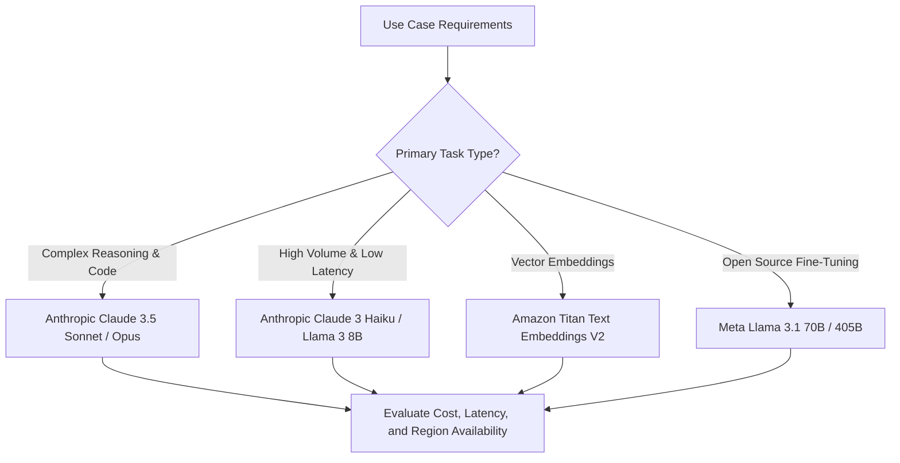

# 03. Cost vs Quality & Latency Trade-Offs

<VideoSection title="Evaluating Cost vs Quality Trade-offs across Bedrock Models: Cost vs Quality & Latency Trade-Offs" youtubeId="rfscVS0vtbw" duration="06:45" motto="Official AWS Bedrock Video Tutorial tailored to Cost vs Quality Trade-offs with clickable timestamped transcripts." whatItDoes="Integrates topic-matched AWS Bedrock video lessons with synchronized transcripts and instant-jump topic bookmarks." clickInstructions="Click the video play button to start watching, or click any timestamp in the interactive transcript to jump directly to that topic." transcript=[{"time": "00:00", "text": "Introduction to Cost vs Quality Trade-offs in Amazon Bedrock.", "timestamp": 0}, {"time": "03:15", "text": "Deep-dive technical walkthrough of Cost vs Quality Trade-offs.", "timestamp": 195}, {"time": "07:30", "text": "Production best practices and hands-on architecture for Cost vs Quality Trade-offs.", "timestamp": 450}] bookmarks=[{"title": "Introduction", "time": "00:00", "timestamp": 0}, {"title": "Cost vs Quality Trade-offs Deep-Dive", "time": "03:15", "timestamp": 195}, {"title": "Production Practices", "time": "07:30", "timestamp": 450}] kbId="doc_aws_bedrock_production" />

## THE TRIANGLE OF MODEL SELECTION

```
                 Quality (Reasoning Depth)
                        /\
                       /  \
                      /    \
                     /      \
  Cost (Budget) ────┴───────┴──── Latency (Response Speed)
```

1. **High Quality, Moderate Latency**: Claude 3.5 Sonnet ($3.00 / $15.00 per 1M tokens)
2. **Ultra Low Latency, Budget Cost**: Claude 3 Haiku ($0.25 / $1.25 per 1M tokens)
3. **Balanced Open Weights**: Meta Llama 3.1 70B ($0.99 / $0.99 per 1M tokens)

> [!TIP]
> **Production Architecture Pattern**: Use a small fast model (Claude 3 Haiku) for initial triage and categorization. Only route complex queries to the large model (Claude 3.5 Sonnet)!

## VISUAL ARCHITECTURE DIAGRAM


