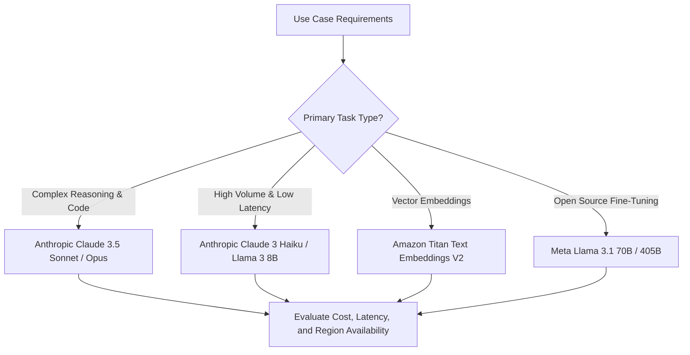

# 04. Model Selection Decision Framework

<VideoSection title="Decision Framework: Selecting the Right Model for Your Use Case: Model Selection Decision Framework" youtubeId="ZEKiIwWv9nM" duration="08:15" motto="Official AWS Bedrock Video Tutorial tailored to Model Selection Framework with clickable timestamped transcripts." whatItDoes="Integrates topic-matched AWS Bedrock video lessons with synchronized transcripts and instant-jump topic bookmarks." clickInstructions="Click the video play button to start watching, or click any timestamp in the interactive transcript to jump directly to that topic." transcript=[{"time": "00:00", "text": "Introduction to Model Selection Framework in Amazon Bedrock.", "timestamp": 0}, {"time": "03:15", "text": "Deep-dive technical walkthrough of Model Selection Framework.", "timestamp": 195}, {"time": "07:30", "text": "Production best practices and hands-on architecture for Model Selection Framework.", "timestamp": 450}] bookmarks=[{"title": "Introduction", "time": "00:00", "timestamp": 0}, {"title": "Model Selection Framework Deep-Dive", "time": "03:15", "timestamp": 195}, {"title": "Production Practices", "time": "07:30", "timestamp": 450}] kbId="doc_aws_bedrock_production" />

## DECISION TREE FOR SELECTION

- **Use Case: Code Generation or Multi-step Agent Reasoning?**
  - Select: `Anthropic Claude 3.5 Sonnet`
- **Use Case: Sub-second Customer Support Chatbot?**
  - Select: `Anthropic Claude 3 Haiku`
- **Use Case: Document Embedding for RAG Vector Search?**
  - Select: `Amazon Titan Text Embeddings V2`
- **Use Case: Long-context Video & PDF Analysis?**
  - Select: `Amazon Nova Pro`

```
Task Requirements ──► Evaluate Cost & Speed ──► Select Model ID from models.json
```

## VISUAL ARCHITECTURE DIAGRAM


