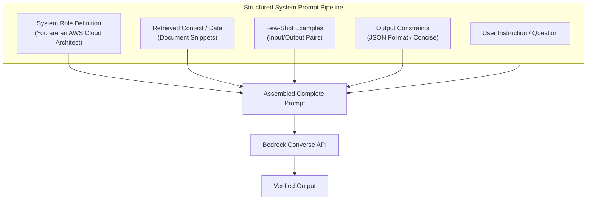

# 01. Prompt Anatomy & Structure

<VideoSection title="Demo: Amazon Bedrock Prompt Management & Template Structure: Prompt Anatomy & Structure" youtubeId="8O5kX73OkIY" duration="10:15" motto="Official AWS Bedrock Video Tutorial tailored to Prompt Structure Fundamentals with clickable timestamped transcripts." whatItDoes="Integrates topic-matched AWS Bedrock video lessons with synchronized transcripts and instant-jump topic bookmarks." clickInstructions="Click the video play button to start watching, or click any timestamp in the interactive transcript to jump directly to that topic." transcript=[{"time": "00:00", "text": "Introduction to Prompt Structure Fundamentals in Amazon Bedrock.", "timestamp": 0}, {"time": "03:15", "text": "Deep-dive technical walkthrough of Prompt Structure Fundamentals.", "timestamp": 195}, {"time": "07:30", "text": "Production best practices and hands-on architecture for Prompt Structure Fundamentals.", "timestamp": 450}] bookmarks=[{"title": "Introduction", "time": "00:00", "timestamp": 0}, {"title": "Prompt Structure Fundamentals Deep-Dive", "time": "03:15", "timestamp": 195}, {"title": "Production Practices", "time": "07:30", "timestamp": 450}] kbId="doc_aws_bedrock_production" />

## WHAT IS PROMPT ENGINEERING?
Prompt engineering is the practice of crafting input text instructions to guide Foundation Models toward accurate, consistent, structured outputs.

## THE 5 ANATOMY ELEMENTS OF A GREAT PROMPT

```
1. ROLE        ──► "Act as a Senior Cloud Security Engineer."
2. TASK        ──► "Analyze the following IAM JSON policy."
3. CONTEXT     ──► "Policy: {'Effect': 'Allow', 'Action': '*'}"
4. CONSTRAINTS ──► "Limit answer to 3 bullet points, under 100 words."
5. FORMAT      ──► "Output in valid JSON with key 'vulnerabilities'."
```

> [!TIP]
> Test and evaluate your prompt structure in the interactive challenge below:

```widget:PromptChallenge
[System Role]
You are a Cloud Security Auditor evaluating AWS IAM policies.

[Context]
Review the following Bedrock invoke policy and identify missing safeguards:
ARN: arn:aws:bedrock:us-east-1::foundation-model/*

[Target Output Requirement]
Return JSON array with severity levels: LOW, MEDIUM, HIGH, CRITICAL.
```

## VISUAL ARCHITECTURE DIAGRAM


