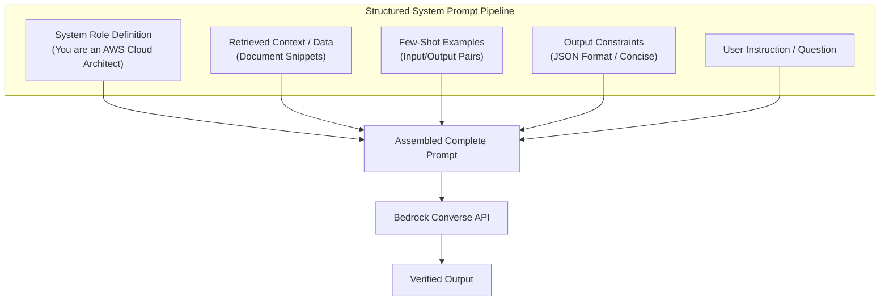

# 02. Zero-Shot vs One-Shot vs Few-Shot Prompting

<VideoSection title="Zero-Shot, One-Shot, and Few-Shot Prompting Techniques: Zero-Shot vs One-Shot vs Few-Shot Prompting" youtubeId="HeW-D6KpDwY" duration="11:40" motto="Official AWS Bedrock Video Tutorial tailored to Zero-Shot vs Few-Shot Prompting with clickable timestamped transcripts." whatItDoes="Integrates topic-matched AWS Bedrock video lessons with synchronized transcripts and instant-jump topic bookmarks." clickInstructions="Click the video play button to start watching, or click any timestamp in the interactive transcript to jump directly to that topic." transcript=[{"time": "00:00", "text": "Introduction to Zero-Shot vs Few-Shot Prompting in Amazon Bedrock.", "timestamp": 0}, {"time": "03:15", "text": "Deep-dive technical walkthrough of Zero-Shot vs Few-Shot Prompting.", "timestamp": 195}, {"time": "07:30", "text": "Production best practices and hands-on architecture for Zero-Shot vs Few-Shot Prompting.", "timestamp": 450}] bookmarks=[{"title": "Introduction", "time": "00:00", "timestamp": 0}, {"title": "Zero-Shot vs Few-Shot Prompting Deep-Dive", "time": "03:15", "timestamp": 195}, {"title": "Production Practices", "time": "07:30", "timestamp": 450}] kbId="doc_aws_bedrock_production" />

## WHAT ARE SHOT EXAMPLES?

1. **Zero-Shot**: Giving instructions without any input/output examples.
   ```
   Classify sentiment: "I love Amazon Bedrock!" -> Positive
   ```
2. **One-Shot**: Providing 1 clear input/output exemplar before the target input.
   ```
   Example:
   Input: "Terrible service." -> Output: NEGATIVE

   Input: "I love Amazon Bedrock!" -> Output:
   ```
3. **Few-Shot**: Providing 3-5 exemplary input/output pairs to enforce strict formatting.

```
Zero-Shot (No Examples) ──► One-Shot (1 Example) ──► Few-Shot (3+ Examples)
```

> [!NOTE]
> Few-shot prompting drastically reduces formatting errors when generating JSON, XML, or custom schema outputs!

## VISUAL ARCHITECTURE DIAGRAM


