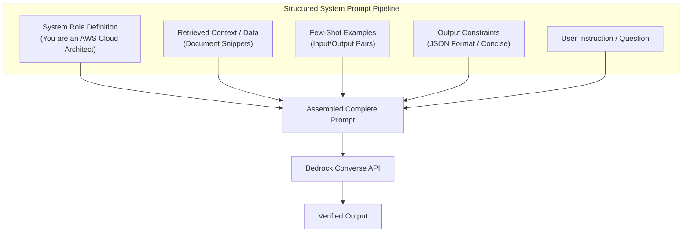

# 03. System Prompts & Role Persona Setting

<VideoSection title="System Role Definition & Context Prompt Structuring: System Prompts & Role Persona Setting" youtubeId="bAwmZVJeO5s" duration="09:30" motto="Official AWS Bedrock Video Tutorial tailored to System Prompts & Roles with clickable timestamped transcripts." whatItDoes="Integrates topic-matched AWS Bedrock video lessons with synchronized transcripts and instant-jump topic bookmarks." clickInstructions="Click the video play button to start watching, or click any timestamp in the interactive transcript to jump directly to that topic." transcript=[{"time": "00:00", "text": "Introduction to System Prompts & Roles in Amazon Bedrock.", "timestamp": 0}, {"time": "03:15", "text": "Deep-dive technical walkthrough of System Prompts & Roles.", "timestamp": 195}, {"time": "07:30", "text": "Production best practices and hands-on architecture for System Prompts & Roles.", "timestamp": 450}] bookmarks=[{"title": "Introduction", "time": "00:00", "timestamp": 0}, {"title": "System Prompts & Roles Deep-Dive", "time": "03:15", "timestamp": 195}, {"title": "Production Practices", "time": "07:30", "timestamp": 450}] kbId="doc_aws_bedrock_production" />

## WHAT IS A SYSTEM PROMPT?
A **System Prompt** sets persistent global instructions, behavioral boundaries, output styling, and role persona for the entire model conversation session.

## BEDROCK CONVERSE API SYSTEM PROMPT SYNTAX

```python
response = bedrock.converse(
    modelId='us.anthropic.claude-3-5-sonnet-20241022-v2:0',
    system=[
        {'text': 'You are a Senior DevOps Security Auditor. Always respond in concise JSON.'}
    ],
    messages=[
        {'role': 'user', 'content': [{'text': 'Check S3 bucket policy.'}]}
    ]
)
```

> [!IMPORTANT]
> System prompts are separate from user messages. They guide the model's fundamental behavior across all chat turns!

## VISUAL ARCHITECTURE DIAGRAM


