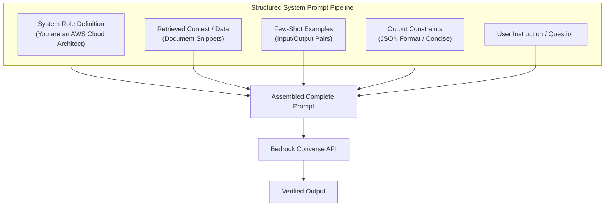

# 04. Educational Step-by-Step Task Breakdown

<VideoSection title="Chain-of-Thought Reasoning & Step-by-Step Prompting: Educational Step-by-Step Task Breakdown" youtubeId="078tYSD7K8E" duration="08:50" motto="Official AWS Bedrock Video Tutorial tailored to Chain-of-Thought Prompting with clickable timestamped transcripts." whatItDoes="Integrates topic-matched AWS Bedrock video lessons with synchronized transcripts and instant-jump topic bookmarks." clickInstructions="Click the video play button to start watching, or click any timestamp in the interactive transcript to jump directly to that topic." transcript=[{"time": "00:00", "text": "Introduction to Chain-of-Thought Prompting in Amazon Bedrock.", "timestamp": 0}, {"time": "03:15", "text": "Deep-dive technical walkthrough of Chain-of-Thought Prompting.", "timestamp": 195}, {"time": "07:30", "text": "Production best practices and hands-on architecture for Chain-of-Thought Prompting.", "timestamp": 450}] bookmarks=[{"title": "Introduction", "time": "00:00", "timestamp": 0}, {"title": "Chain-of-Thought Prompting Deep-Dive", "time": "03:15", "timestamp": 195}, {"title": "Production Practices", "time": "07:30", "timestamp": 450}] kbId="doc_aws_bedrock_production" />

## HOW TO GUIDE COMPLEX REASONING
When asking models to solve math problems, code bugs, or architectural decisions, instruct the model to break down tasks explicitly into logical steps:

```
Instructions:
1. Identify the input problem.
2. Verify constraints.
3. Formulate solution step-by-step.
4. Verify edge cases.
5. Provide final answer.
```

## EDUCATIONAL TRACE PATTERN
```
Problem Statement ──► Step 1: Breakdown ──► Step 2: Verification ──► Final Output
```

> [!NOTE]
> Instructing models to "Think step-by-step before answering" significantly improves accuracy on logic and coding benchmarks!

## VISUAL ARCHITECTURE DIAGRAM


