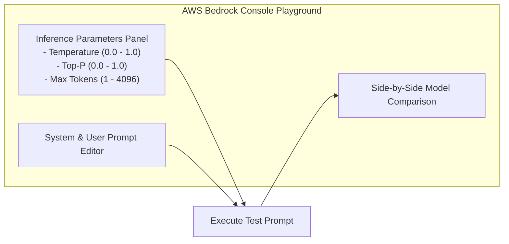

# 01. Interactive Playground Controls

<VideoSection title="Demo: Amazon Bedrock Text Playground & Parameters: Interactive Playground Controls" youtubeId="S73thl0AyFU" duration="14:11" motto="Official AWS Bedrock Video Tutorial tailored to Playground Parameters with clickable timestamped transcripts." whatItDoes="Integrates topic-matched AWS Bedrock video lessons with synchronized transcripts and instant-jump topic bookmarks." clickInstructions="Click the video play button to start watching, or click any timestamp in the interactive transcript to jump directly to that topic." transcript=[{"time": "00:00", "text": "Introduction to Playground Parameters in Amazon Bedrock.", "timestamp": 0}, {"time": "03:15", "text": "Deep-dive technical walkthrough of Playground Parameters.", "timestamp": 195}, {"time": "07:30", "text": "Production best practices and hands-on architecture for Playground Parameters.", "timestamp": 450}] bookmarks=[{"title": "Introduction", "time": "00:00", "timestamp": 0}, {"title": "Playground Parameters Deep-Dive", "time": "03:15", "timestamp": 195}, {"title": "Production Practices", "time": "07:30", "timestamp": 450}] kbId="doc_aws_bedrock_production" />

## PLAYGROUND CONTROLS OVERVIEW
In this module, you will interactively experiment with inference parameters:
- **Model**: Switch between Claude 3.5 Sonnet, Claude 3 Haiku, Llama 3.1, Nova Pro.
- **Temperature**: Adjust from 0.0 (exact) to 1.0 (creative).
- **Max Tokens**: Limit output generation length.
- **Top P**: Filter probability nucleus.

```widget:BedrockPlayground
{
  "modelId": "anthropic.claude-3-5-sonnet-20241022-v2:0",
  "inferenceConfig": {
    "temperature": 0.7,
    "topP": 0.9,
    "maxTokens": 2048,
    "stopSequences": ["\n\nHuman:"]
  },
  "systemPrompt": "You are a senior AWS Solutions Architect specializing in serverless Bedrock architectures.",
  "userPrompt": "Explain how Amazon Bedrock Knowledge Bases sync with OpenSearch Serverless vector indices."
}
```

## VISUAL ARCHITECTURE DIAGRAM


