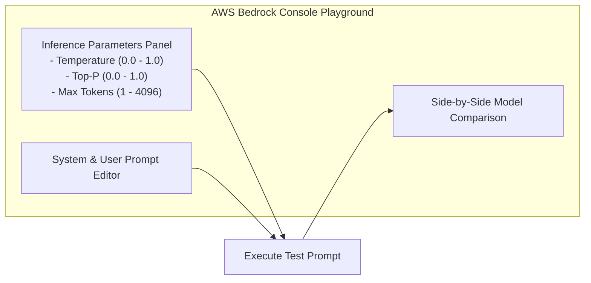

# 02. Temperature Experiments & Behavior Output

<VideoSection title="Interactive Temperature & Top-P Experiments in Playground: Temperature Experiments & Behavior Output" youtubeId="qVyvmzFxF_o" duration="08:30" motto="Official AWS Bedrock Video Tutorial tailored to Temperature Experiments with clickable timestamped transcripts." whatItDoes="Integrates topic-matched AWS Bedrock video lessons with synchronized transcripts and instant-jump topic bookmarks." clickInstructions="Click the video play button to start watching, or click any timestamp in the interactive transcript to jump directly to that topic." transcript=[{"time": "00:00", "text": "Introduction to Temperature Experiments in Amazon Bedrock.", "timestamp": 0}, {"time": "03:15", "text": "Deep-dive technical walkthrough of Temperature Experiments.", "timestamp": 195}, {"time": "07:30", "text": "Production best practices and hands-on architecture for Temperature Experiments.", "timestamp": 450}] bookmarks=[{"title": "Introduction", "time": "00:00", "timestamp": 0}, {"title": "Temperature Experiments Deep-Dive", "time": "03:15", "timestamp": 195}, {"title": "Production Practices", "time": "07:30", "timestamp": 450}] kbId="doc_aws_bedrock_production" />

## EXPERIMENT 1: TEMPERATURE = 0.0 VS 1.0
Ask the exact same prompt twice:
> *"Write 2 bullet points on why AWS IAM is important."*

- **At Temp = 0.0**: Results are deterministic, structured, and factual.
- **At Temp = 1.0**: Results use creative metaphors and varied vocabulary.

> [!TIP]
> Use Temperature = 0.0 for all production data extraction pipelines to prevent output variance!

## VISUAL ARCHITECTURE DIAGRAM

