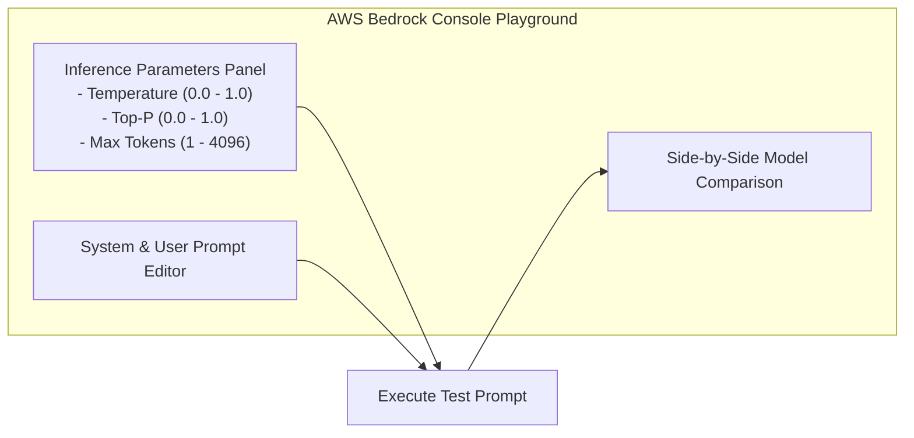

# 03. System Prompt Persona Experiments

<VideoSection title="Comparing System Prompt Variations Side-by-Side: System Prompt Persona Experiments" youtubeId="lIId8IDP6TU" duration="09:15" motto="Official AWS Bedrock Video Tutorial tailored to System Prompt Comparisons with clickable timestamped transcripts." whatItDoes="Integrates topic-matched AWS Bedrock video lessons with synchronized transcripts and instant-jump topic bookmarks." clickInstructions="Click the video play button to start watching, or click any timestamp in the interactive transcript to jump directly to that topic." transcript=[{"time": "00:00", "text": "Introduction to System Prompt Comparisons in Amazon Bedrock.", "timestamp": 0}, {"time": "03:15", "text": "Deep-dive technical walkthrough of System Prompt Comparisons.", "timestamp": 195}, {"time": "07:30", "text": "Production best practices and hands-on architecture for System Prompt Comparisons.", "timestamp": 450}] bookmarks=[{"title": "Introduction", "time": "00:00", "timestamp": 0}, {"title": "System Prompt Comparisons Deep-Dive", "time": "03:15", "timestamp": 195}, {"title": "Production Practices", "time": "07:30", "timestamp": 450}] kbId="doc_aws_bedrock_production" />

## EXPERIMENT 2: PERSONA SWITCHING
Change the System Prompt while keeping the User Prompt identical:
- **System Prompt A**: `"You are a pirate captain. Answer in pirate slang."`
- **System Prompt B**: `"You are a strict AWS Compliance Auditor. Answer in formal legal prose."`

User Prompt: *"What is an S3 Bucket?"*

Notice how System Prompts completely transform the output tone without changing model parameters!

## VISUAL ARCHITECTURE DIAGRAM

