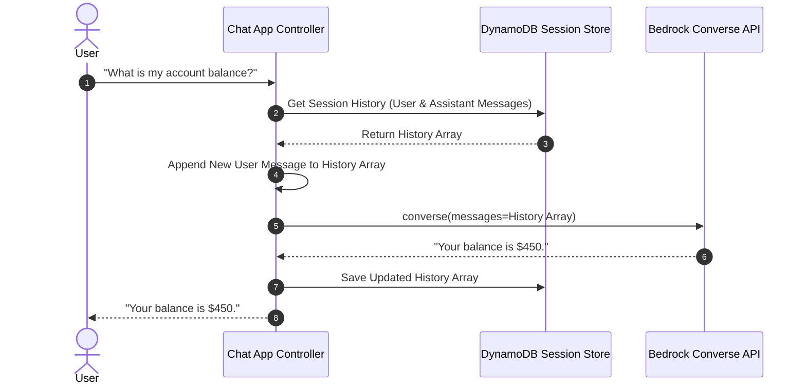

# 02. Session State & DynamoDB History Storage

<VideoSection title="Managing Conversation Session History in DynamoDB: Session State & DynamoDB History Storage" youtubeId="HeW-D6KpDwY" duration="13:15" motto="Official AWS Bedrock Video Tutorial tailored to Conversation Memory with clickable timestamped transcripts." whatItDoes="Integrates topic-matched AWS Bedrock video lessons with synchronized transcripts and instant-jump topic bookmarks." clickInstructions="Click the video play button to start watching, or click any timestamp in the interactive transcript to jump directly to that topic." transcript=[{"time": "00:00", "text": "Introduction to Conversation Memory in Amazon Bedrock.", "timestamp": 0}, {"time": "03:15", "text": "Deep-dive technical walkthrough of Conversation Memory.", "timestamp": 195}, {"time": "07:30", "text": "Production best practices and hands-on architecture for Conversation Memory.", "timestamp": 450}] bookmarks=[{"title": "Introduction", "time": "00:00", "timestamp": 0}, {"title": "Conversation Memory Deep-Dive", "time": "03:15", "timestamp": 195}, {"title": "Production Practices", "time": "07:30", "timestamp": 450}] kbId="doc_aws_bedrock_production" />

## PERSISTING SESSION CHAT HISTORY
In production, store chat history in Amazon DynamoDB keyed by `session_id`:

```
User Message ──► Backend ──► Load Session History (DynamoDB) ──► Append New Msg ──► Invoke Bedrock ──► Save Response (DynamoDB)
```

```python
import boto3

dynamodb = boto3.resource('dynamodb')
table = dynamodb.Table('ChatSessions')

def get_session_history(session_id):
    res = table.get_item(Key={'sessionId': session_id})
    return res.get('Item', {}).get('messages', [])
```

## VISUAL ARCHITECTURE DIAGRAM


