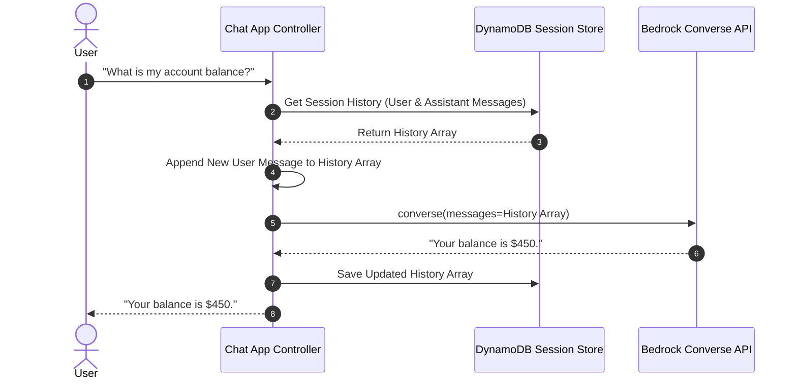

# 03. Tangible Milestone #3: Context Pruning & Chatbot

<VideoSection title="Context Window Management & Sliding Message Buffer: Tangible Milestone #3: Context Pruning & Chatbot" youtubeId="bAwmZVJeO5s" duration="10:40" motto="Official AWS Bedrock Video Tutorial tailored to Context Pruning with clickable timestamped transcripts." whatItDoes="Integrates topic-matched AWS Bedrock video lessons with synchronized transcripts and instant-jump topic bookmarks." clickInstructions="Click the video play button to start watching, or click any timestamp in the interactive transcript to jump directly to that topic." transcript=[{"time": "00:00", "text": "Introduction to Context Pruning in Amazon Bedrock.", "timestamp": 0}, {"time": "03:15", "text": "Deep-dive technical walkthrough of Context Pruning.", "timestamp": 195}, {"time": "07:30", "text": "Production best practices and hands-on architecture for Context Pruning.", "timestamp": 450}] bookmarks=[{"title": "Introduction", "time": "00:00", "timestamp": 0}, {"title": "Context Pruning Deep-Dive", "time": "03:15", "timestamp": 195}, {"title": "Production Practices", "time": "07:30", "timestamp": 450}] kbId="doc_aws_bedrock_production" />

## CONTEXT PRUNING STRATEGIES
As chat history grows long, prune or summarize older turns to stay within token limits and control costs:

```python
def prune_history(messages, max_turns=10):
    # Always keep system instructions & last 10 turns
    if len(messages) > max_turns:
        return messages[-max_turns:]
    return messages
```

## FULL CHATBOT BACKEND CLASS

```python
class BedrockChatbot:
    def __init__(self, model_id='us.anthropic.claude-3-haiku-20240307-v1:0'):
        self.bedrock = boto3.client('bedrock-runtime', region_name='us-east-1')
        self.model_id = model_id
        self.history = []

    def chat(self, user_text):
        self.history.append({"role": "user", "content": [{"text": user_text}]})
        response = self.bedrock.converse(
            modelId=self.model_id,
            system=[{"text": "You are a helpful IT assistant."}],
            messages=self.history
        )
        reply = response['output']['message']['content'][0]['text']
        self.history.append({"role": "assistant", "content": [{"text": reply}]})
        return reply
```

## VISUAL ARCHITECTURE DIAGRAM


