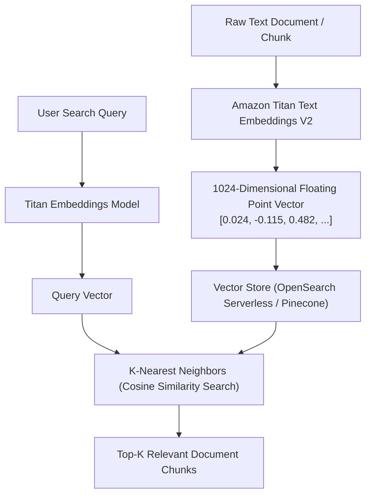

# 01. What Are Vector Embeddings?

<VideoSection title="Amazon Titan Text Embeddings V2 & High-Dimensional Vectors: What Are Vector Embeddings?" youtubeId="078tYSD7K8E" duration="08:35" motto="Official AWS Bedrock Video Tutorial tailored to Embeddings Fundamentals with clickable timestamped transcripts." whatItDoes="Integrates topic-matched AWS Bedrock video lessons with synchronized transcripts and instant-jump topic bookmarks." clickInstructions="Click the video play button to start watching, or click any timestamp in the interactive transcript to jump directly to that topic." transcript=[{"time": "00:00", "text": "Introduction to Embeddings Fundamentals in Amazon Bedrock.", "timestamp": 0}, {"time": "03:15", "text": "Deep-dive technical walkthrough of Embeddings Fundamentals.", "timestamp": 195}, {"time": "07:30", "text": "Production best practices and hands-on architecture for Embeddings Fundamentals.", "timestamp": 450}] bookmarks=[{"title": "Introduction", "time": "00:00", "timestamp": 0}, {"title": "Embeddings Fundamentals Deep-Dive", "time": "03:15", "timestamp": 195}, {"title": "Production Practices", "time": "07:30", "timestamp": 450}] kbId="doc_aws_bedrock_production" />

## WHAT IS AN EMBEDDING?
An **Embedding** is a mathematical vector (a list of floating-point numbers) that represents the semantic meaning of text, images, or audio.

```
"King"   ──► Embedding Model ──► [0.82, 0.74, 0.12, 0.05, ..., -0.31]
"Queen"  ──► Embedding Model ──► [0.79, 0.81, 0.14, 0.08, ..., -0.28]
"Banana" ──► Embedding Model ──► [0.08, 0.14, 0.88, 0.89, ..., 0.44]
```

## WHY EMBEDDINGS MATTER FOR AI SEARCH
Traditional keyword search fails when users use synonyms:
- User searches: *"How do I reset password?"*
- Keyword search misses document: *"Steps for credential recovery."*

With embeddings, `"reset password"` and `"credential recovery"` have nearly identical vector coordinates!

```widget:VectorEmbedding
import boto3, json

# Amazon Titan Text Embeddings V2 Reference Code
bedrock = boto3.client('bedrock-runtime', region_name='us-east-1')

def generate_titan_embedding(text):
    payload = json.dumps({
        "inputText": text,
        "dimensions": 1024,
        "normalize": True
    })
    response = bedrock.invoke_model(
        modelId='amazon.titan-embed-text-v2:0',
        contentType='application/json',
        accept='application/json',
        body=payload
    )
    body = json.loads(response['body'].read())
    return body['embedding'] # Returns 1024-dimensional float vector
```

## VISUAL ARCHITECTURE DIAGRAM


