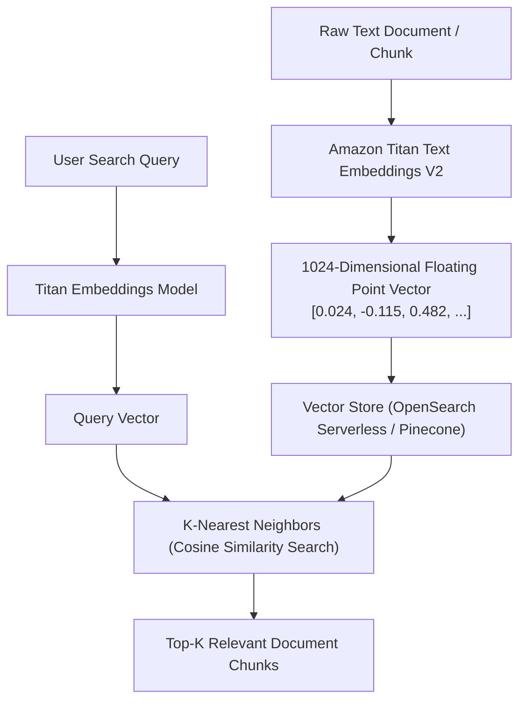

# 02. Cosine Similarity & Vector Distance

<VideoSection title="Semantic Distance, Vector Spaces & Cosine Similarity: Cosine Similarity & Vector Distance" youtubeId="jU0cndZziO0" duration="09:20" motto="Official AWS Bedrock Video Tutorial tailored to Vector Similarity Search with clickable timestamped transcripts." whatItDoes="Integrates topic-matched AWS Bedrock video lessons with synchronized transcripts and instant-jump topic bookmarks." clickInstructions="Click the video play button to start watching, or click any timestamp in the interactive transcript to jump directly to that topic." transcript=[{"time": "00:00", "text": "Introduction to Vector Similarity Search in Amazon Bedrock.", "timestamp": 0}, {"time": "03:15", "text": "Deep-dive technical walkthrough of Vector Similarity Search.", "timestamp": 195}, {"time": "07:30", "text": "Production best practices and hands-on architecture for Vector Similarity Search.", "timestamp": 450}] bookmarks=[{"title": "Introduction", "time": "00:00", "timestamp": 0}, {"title": "Vector Similarity Search Deep-Dive", "time": "03:15", "timestamp": 195}, {"title": "Production Practices", "time": "07:30", "timestamp": 450}] kbId="doc_aws_bedrock_production" />

## MATHEMATICAL COSINE SIMILARITY
To measure how closely two pieces of text relate in meaning, vector engines compute **Cosine Similarity** (the angle between vectors in N-dimensional space):

$$\text{Similarity Score} = \frac{\mathbf{A} \cdot \mathbf{B}}{\|\mathbf{A}\| \|\mathbf{B}\|}$$

- `Score = 1.0`: Identical semantic meaning.
- `Score = 0.0`: Completely unrelated concepts.

```
"Cat" vs "Kitten"    ──► Cosine Similarity: 0.94
"Cat" vs "Submarine" ──► Cosine Similarity: 0.08
```

## AMAZON TITAN EMBEDDINGS V2
On Bedrock, use `amazon.titan-embed-text-v2:0` to convert text into normalized 1,024-dimension vectors.

## VISUAL ARCHITECTURE DIAGRAM


