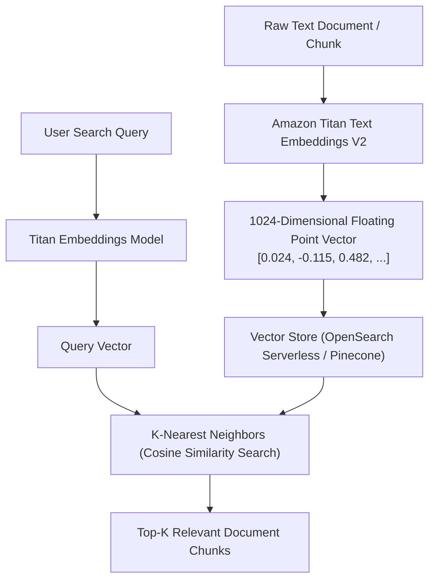

# 03. Chunking Strategies & Vector Databases

<VideoSection title="Vector Stores: OpenSearch Serverless, Pinecone & Chunking: Chunking Strategies & Vector Databases" youtubeId="S73thl0AyFU" duration="11:15" motto="Official AWS Bedrock Video Tutorial tailored to Vector Databases with clickable timestamped transcripts." whatItDoes="Integrates topic-matched AWS Bedrock video lessons with synchronized transcripts and instant-jump topic bookmarks." clickInstructions="Click the video play button to start watching, or click any timestamp in the interactive transcript to jump directly to that topic." transcript=[{"time": "00:00", "text": "Introduction to Vector Databases in Amazon Bedrock.", "timestamp": 0}, {"time": "03:15", "text": "Deep-dive technical walkthrough of Vector Databases.", "timestamp": 195}, {"time": "07:30", "text": "Production best practices and hands-on architecture for Vector Databases.", "timestamp": 450}] bookmarks=[{"title": "Introduction", "time": "00:00", "timestamp": 0}, {"title": "Vector Databases Deep-Dive", "time": "03:15", "timestamp": 195}, {"title": "Production Practices", "time": "07:30", "timestamp": 450}] kbId="doc_aws_bedrock_production" />

## CHUNKING STRATEGIES
Before generating embeddings, long PDFs and markdown documents must be broken into **chunks**:

1. **Fixed-Size Chunking**: Split every 500 tokens with 50-token overlap.
2. **Hierarchical / Semantic Chunking**: Split by paragraph headings, markdown sections, or document sub-chapters.

```
Long Document (10,000 Tokens) ──► Chunking (500 tokens/chunk) ──► Embeddings Generator ──► Vector Index
```

## LEADING VECTOR DATABASES
- **Amazon OpenSearch Serverless** (Native AWS integration)
- **Pinecone**
- **Amazon Aurora PostgreSQL with pgvector extension**

## VISUAL ARCHITECTURE DIAGRAM


