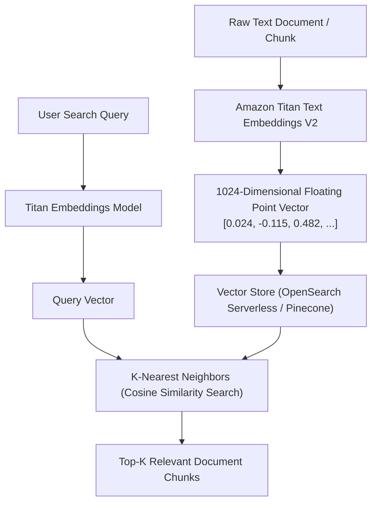

# 04. Generating Embeddings via Boto3

<VideoSection title="K-Nearest Neighbors (KNN) Search in Practice: Generating Embeddings via Boto3" youtubeId="qVyvmzFxF_o" duration="10:05" motto="Official AWS Bedrock Video Tutorial tailored to KNN Vector Search with clickable timestamped transcripts." whatItDoes="Integrates topic-matched AWS Bedrock video lessons with synchronized transcripts and instant-jump topic bookmarks." clickInstructions="Click the video play button to start watching, or click any timestamp in the interactive transcript to jump directly to that topic." transcript=[{"time": "00:00", "text": "Introduction to KNN Vector Search in Amazon Bedrock.", "timestamp": 0}, {"time": "03:15", "text": "Deep-dive technical walkthrough of KNN Vector Search.", "timestamp": 195}, {"time": "07:30", "text": "Production best practices and hands-on architecture for KNN Vector Search.", "timestamp": 450}] bookmarks=[{"title": "Introduction", "time": "00:00", "timestamp": 0}, {"title": "KNN Vector Search Deep-Dive", "time": "03:15", "timestamp": 195}, {"title": "Production Practices", "time": "07:30", "timestamp": 450}] kbId="doc_aws_bedrock_production" />

## BOTO3 TITAN EMBEDDINGS CODE EXAMPLE

```python
import boto3
import json

bedrock = boto3.client('bedrock-runtime', region_name='us-east-1')

text_input = "Amazon Bedrock supports vector embeddings for semantic search."

response = bedrock.invoke_model(
    modelId='amazon.titan-embed-text-v2:0',
    contentType='application/json',
    accept='application/json',
    body=json.dumps({"inputText": text_input})
)

response_body = json.loads(response['body'].read())
embedding_vector = response_body['embedding']

print(f"[SUCCESS] Generated Vector with {len(embedding_vector)} dimensions.")
print(f"Sample Vector: {embedding_vector[:5]}...")
```

## VISUAL ARCHITECTURE DIAGRAM


