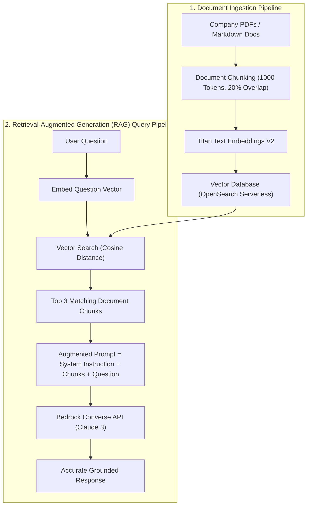

# 01. Why RAG? Overcoming Knowledge Limitations

<VideoSection title="Why RAG? Overcoming LLM Static Knowledge Cutoffs: Why RAG? Overcoming Knowledge Limitations" youtubeId="lIId8IDP6TU" duration="12:45" motto="Official AWS Bedrock Video Tutorial tailored to RAG Concept & Motivation with clickable timestamped transcripts." whatItDoes="Integrates topic-matched AWS Bedrock video lessons with synchronized transcripts and instant-jump topic bookmarks." clickInstructions="Click the video play button to start watching, or click any timestamp in the interactive transcript to jump directly to that topic." transcript=[{"time": "00:00", "text": "Introduction to RAG Concept & Motivation in Amazon Bedrock.", "timestamp": 0}, {"time": "03:15", "text": "Deep-dive technical walkthrough of RAG Concept & Motivation.", "timestamp": 195}, {"time": "07:30", "text": "Production best practices and hands-on architecture for RAG Concept & Motivation.", "timestamp": 450}] bookmarks=[{"title": "Introduction", "time": "00:00", "timestamp": 0}, {"title": "RAG Concept & Motivation Deep-Dive", "time": "03:15", "timestamp": 195}, {"title": "Production Practices", "time": "07:30", "timestamp": 450}] kbId="doc_aws_bedrock_production" />

## THE TWO MAJOR LIMITATIONS OF LLMs
1. **Static Knowledge Cutoff**: Models do not know about events or document changes after their pre-training date.
2. **Private Data Exclusion**: Models have no access to your company's private internal wikis, customer database, or proprietary PDFs.

## THE SOLUTION: RETRIEVAL-AUGMENTED GENERATION (RAG)
**RAG** connects an LLM to an external vector database. When a user asks a question, the system retrieves relevant document chunks and feeds them into the model prompt as verified context!

```widget:RagSimulator
import boto3, json

# Amazon Bedrock Knowledge Bases RAG Retrieval & Generation Reference
bedrock_agent_runtime = boto3.client('bedrock-agent-runtime', region_name='us-east-1')

def ask_knowledge_base(user_query, kb_id):
    response = bedrock_agent_runtime.retrieve_and_generate(
        input={'text': user_query},
        retrieveAndGenerateConfiguration={
            'type': 'KNOWLEDGE_BASE',
            'knowledgeBaseConfiguration': {
                'knowledgeBaseId': kb_id,
                'modelArn': 'arn:aws:bedrock:us-east-1::foundation-model/anthropic.claude-3-5-sonnet-20241022-v2:0',
                'retrievalConfiguration': {
                    'vectorSearchConfiguration': {'numberOfResults': 5}
                }
            }
        }
    )
    return response['output']['text']
```

## VISUAL ARCHITECTURE DIAGRAM


