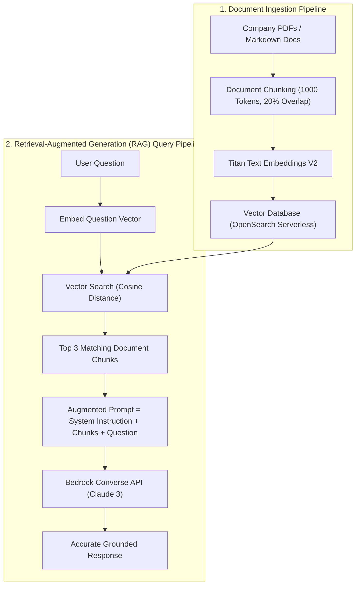

# 02. End-to-End RAG Architecture Deep Dive

<VideoSection title="End-to-End RAG System Architecture Deep Dive: End-to-End RAG Architecture Deep Dive" youtubeId="t2_Q2BRzeEE" duration="14:20" motto="Official AWS Bedrock Video Tutorial tailored to RAG System Architecture with clickable timestamped transcripts." whatItDoes="Integrates topic-matched AWS Bedrock video lessons with synchronized transcripts and instant-jump topic bookmarks." clickInstructions="Click the video play button to start watching, or click any timestamp in the interactive transcript to jump directly to that topic." transcript=[{"time": "00:00", "text": "Introduction to RAG System Architecture in Amazon Bedrock.", "timestamp": 0}, {"time": "03:15", "text": "Deep-dive technical walkthrough of RAG System Architecture.", "timestamp": 195}, {"time": "07:30", "text": "Production best practices and hands-on architecture for RAG System Architecture.", "timestamp": 450}] bookmarks=[{"title": "Introduction", "time": "00:00", "timestamp": 0}, {"title": "RAG System Architecture Deep-Dive", "time": "03:15", "timestamp": 195}, {"title": "Production Practices", "time": "07:30", "timestamp": 450}] kbId="doc_aws_bedrock_production" />

## THE 6 STEPS OF RAG EXECUTION

```
1. Document Ingestion  ──► S3 Bucket (PDFs, Markdown, DOCX)
2. Chunking & Vector   ──► Split text into chunks & run Titan Embeddings V2
3. Vector Store Index  ──► OpenSearch Serverless Vector Database
4. Vector Search       ──► User query converted to vector & retrieves Top-K chunks
5. Prompt Construction ──► Append retrieved chunks into System Prompt context
6. Model Generation    ──► Claude 3.5 Sonnet generates grounded answer with citations
```

> [!IMPORTANT]
> Because the model is instructed to answer strictly based on retrieved context, hallucinations drop to near zero!

## VISUAL ARCHITECTURE DIAGRAM


